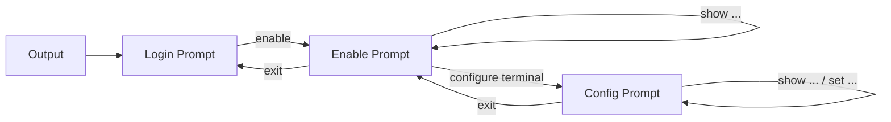
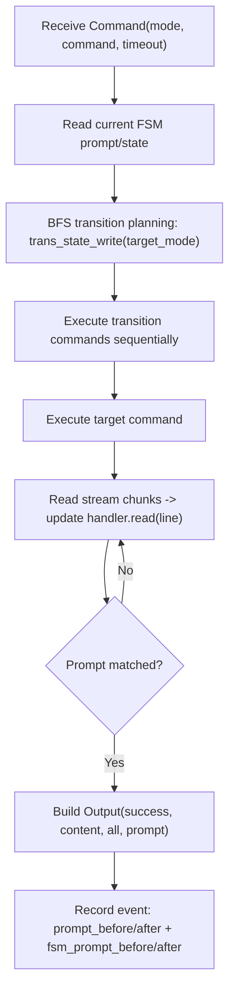

# rneter

[](https://crates.io/crates/rneter)
[](https://docs.rs/rneter)
[](https://opensource.org/licenses/MIT)

[中文文档](README_zh.md)

`rneter` is a Rust library for managing SSH connections to network devices with intelligent state machine handling. It provides a high-level API for connecting to network devices (routers, switches, etc.), executing commands, and managing device states with automatic prompt detection and mode switching.

## Features

- **Connection Pooling**: Automatically caches and reuses SSH connections for better performance
- **State Machine Management**: Intelligent device state tracking and automatic transitions
- **Prompt Detection**: Automatic prompt recognition and handling across different device types
- **Mode Switching**: Seamless transitions between device modes (user mode, enable mode, config mode, etc.)
- **Maximum Compatibility**: Supports a wide range of SSH algorithms including legacy protocols for older devices
- **Async/Await**: Built on Tokio for high-performance asynchronous operations
- **Error Handling**: Comprehensive error types with detailed context

## Installation

Add this to your `Cargo.toml`:

```toml
[dependencies]
rneter = "0.1"
```

## Quick Start

```rust
use rneter::session::{MANAGER, Command, CmdJob};
use rneter::templates;

#[tokio::main]
async fn main() -> Result<(), Box<dyn std::error::Error>> {
    // Use a predefined device template (e.g., Cisco)
    let handler = templates::cisco()?;

    // Get a connection from the manager
    let sender = MANAGER.get(
        "admin".to_string(),
        "192.168.1.1".to_string(),
        22,
        "password".to_string(),
        None,
        handler,
    ).await?;

    // Execute a command
    let (tx, rx) = tokio::sync::oneshot::channel();
    let cmd = CmdJob {
        data: Command {
            mode: "Enable".to_string(), // Cisco template uses "Enable" mode
            command: "show version".to_string(),
            timeout: Some(60),
        },
        sys: None,
        responder: tx,
    };
    
    sender.send(cmd).await?;
    let output = rx.await??;
    
    println!("Command successful: {}", output.success);
    println!("Output: {}", output.content);
    Ok(())
}
```

### Security Levels

`rneter` now supports secure defaults and configurable SSH security levels when connecting:

```rust
use rneter::session::{ConnectionSecurityOptions, MANAGER};
use rneter::templates;

let handler = templates::cisco()?;

// Secure by default (uses known_hosts verification + strict algorithms)
let _sender = MANAGER.get(
    "admin".to_string(),
    "192.168.1.1".to_string(),
    22,
    "password".to_string(),
    None,
    handler,
).await?;

// Explicitly choose a security profile
let _sender = MANAGER.get_with_security(
    "admin".to_string(),
    "192.168.1.1".to_string(),
    22,
    "password".to_string(),
    None,
    templates::cisco()?,
    ConnectionSecurityOptions::legacy_compatible(),
).await?;
```

### Session Recording and Replay

```rust
use rneter::session::{MANAGER, SessionRecordLevel, SessionReplayer};
use rneter::templates;

let (sender, recorder) = MANAGER.get_with_recording(
    "admin".to_string(),
    "192.168.1.1".to_string(),
    22,
    "password".to_string(),
    None,
    templates::cisco()?,
).await?;

// Or record key events only (no raw shell chunks)
let (_sender2, _recorder2) = MANAGER.get_with_recording_level(
    "admin".to_string(),
    "192.168.1.1".to_string(),
    22,
    "password".to_string(),
    None,
    templates::cisco()?,
    SessionRecordLevel::KeyEventsOnly,
).await?;

// ...send CmdJob through `sender`...

// Export recording as JSONL
let jsonl = recorder.to_jsonl()?;

// Restore and replay offline
let restored = rneter::session::SessionRecorder::from_jsonl(&jsonl)?;
let mut replayer = SessionReplayer::from_recorder(&restored);
let replayed_output = replayer.replay_next("show version")?;
println!("Replayed output: {}", replayed_output.content);

// Offline command-flow testing without real SSH
let script = vec![
    rneter::session::Command {
        mode: "Enable".to_string(),
        command: "terminal length 0".to_string(),
        timeout: None,
    },
    rneter::session::Command {
        mode: "Enable".to_string(),
        command: "show version".to_string(),
        timeout: None,
    },
];
let outputs = replayer.replay_script(&script)?;
assert_eq!(outputs.len(), 2);
```

For CI-style offline tests, you can store JSONL recordings under `tests/fixtures/`
and replay them in integration tests (see `tests/replay_fixtures.rs`).

To normalize noisy online recordings into stable fixtures:

```bash
cargo run --example normalize_fixture -- raw_session.jsonl tests/fixtures/session_new.jsonl
```

New recording/replay capabilities:

- Prompt tracking: each `command_output` now records both `prompt_before`/`prompt_after`
- FSM prompt tracking: each event can include `fsm_prompt_before`/`fsm_prompt_after`
- Output prompt: command/replay results now include `Output.prompt`
- Schema compatibility: legacy `connection_established` fields (`prompt`/`state`) remain readable
- Fixture quality workflow: `tests/fixtures/` includes success/failure/state-switch samples and snapshot checks in `tests/replay_fixtures.rs`

Example `command_output` event shape:

```json
{
  "kind": "command_output",
  "command": "show version",
  "mode": "Enable",
  "prompt_before": "router#",
  "prompt_after": "router#",
  "fsm_prompt_before": "enable",
  "fsm_prompt_after": "enable",
  "success": true,
  "content": "Version 1.0",
  "all": "show version\nVersion 1.0\nrouter#"
}
```

## Architecture

### Connection Management

The `SshConnectionManager` provides a singleton connection pool accessible via the `MANAGER` constant. It automatically:
- Caches connections for 5 minutes of inactivity
- Reconnects on connection failure
- Manages up to 100 concurrent connections

### State Machine

The `DeviceHandler` implements a finite state machine that:
- Tracks the current device state using regex patterns
- Finds optimal paths between states using BFS
- Handles automatic state transitions
- Supports system-specific states (e.g., different VRFs or contexts)

#### Design Rationale

The state machine is designed around two stable facts in network-device automation:
1. Prompts are more reliable than command text for identifying current mode.
2. Transition paths vary by vendor/model, so pathfinding must be data-driven.

Core design choices:
- Normalize states to lowercase and map prompt regex matches to state indexes for fast lookups.
- Separate prompt detection (`read_prompt`) from state update (`read`) to keep command loops predictable.
- Model transitions as a directed graph (`edges`) and use BFS to find shortest valid mode switch path.
- Keep dynamic input handling (`read_need_write`) independent from command logic, so password/confirm flows are reusable.
- Track both CLI prompt text and FSM prompt (state name) to support online diagnostics and offline replay assertions.

Benefits:
- Better portability: vendor-specific behavior is mostly data configuration, not hard-coded branches.
- Better resilience: command execution relies on prompt/state convergence instead of fixed output formats.
- Better testability: record/replay can validate state transitions and prompt evolution without real SSH sessions.

#### State Transition Model



#### Command Execution Flow (State-Aware)



### Command Execution

Commands are executed through an async channel-based architecture:
1. Submit a `CmdJob` to the connection sender
2. The library automatically transitions to the target state if needed
3. Executes the command and waits for the prompt
4. Returns the output with success status

## Supported Device Types

The library is designed to work with any SSH-enabled network device. It's particularly well-suited for:

- Cisco IOS/IOS-XE/IOS-XR devices
- Juniper JunOS devices
- Arista EOS devices
- Huawei VRP devices
- Generic Linux/Unix systems accessible via SSH

## Configuration

### SSH Algorithm Support

`rneter` includes comprehensive SSH algorithm support in the `config` module:
- Key exchange: Curve25519, DH groups, ECDH
- Ciphers: AES (CTR/CBC/GCM), ChaCha20-Poly1305
- MAC: HMAC-SHA1/256/512 with ETM variants
- Host keys: Ed25519, ECDSA, RSA, DSA (for legacy devices)

This ensures maximum compatibility with both modern and legacy network equipment.

## Error Handling

The library provides detailed error types through `ConnectError`:

- `UnreachableState`: Target state cannot be reached from current state
- `TargetStateNotExistError`: Requested state doesn't exist in configuration
- `ChannelDisconnectError`: SSH channel disconnected unexpectedly
- `ExecTimeout`: Command execution exceeded timeout
- And more...

## Documentation

For detailed API documentation, visit [docs.rs/rneter](https://docs.rs/rneter).

## License

This project is licensed under the MIT License - see the [LICENSE](LICENSE) file for details.

## Contributing

Contributions are welcome! Please feel free to submit a Pull Request.

## Author

demohiiiii
