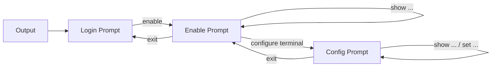
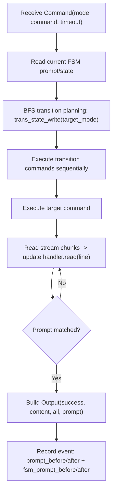

# rneter

[](https://crates.io/crates/rneter)
[](https://docs.rs/rneter)
[](https://opensource.org/licenses/MIT)

[中文文档](README_zh.md)

`rneter` is a Rust library for managing SSH connections to network devices with intelligent state machine handling. It provides a high-level API for connecting to network devices (routers, switches, etc.), executing commands, and managing device states with automatic prompt detection and mode switching.

## Features

- **Connection Pooling**: Automatically caches and reuses SSH connections for better performance
- **State Machine Management**: Intelligent device state tracking and automatic transitions
- **Prompt Detection**: Automatic prompt recognition and handling across different device types
- **Mode Switching**: Seamless transitions between device modes (user mode, enable mode, config mode, etc.)
- **SFTP File Uploads**: Upload local files to remote hosts that expose the SSH `sftp` subsystem
- **CLI SCP/TFTP Transfers**: Drive supported network devices through interactive `copy scp:` / `copy tftp:` workflows
- **Maximum Compatibility**: Supports a wide range of SSH algorithms including legacy protocols for older devices
- **Async/Await**: Built on Tokio for high-performance asynchronous operations
- **Error Handling**: Comprehensive error types with detailed context

## Installation

Add this to your `Cargo.toml`:

```toml
[dependencies]
rneter = "0.3"
```

## Quick Start

```rust
use rneter::session::{ConnectionRequest, ExecutionContext, MANAGER, Command, CmdJob};
use rneter::templates;

#[tokio::main]
async fn main() -> Result<(), Box<dyn std::error::Error>> {
    // Use a predefined device template (e.g., Cisco)
    let handler = templates::cisco()?;

    // Get a connection from the manager
    let sender = MANAGER
        .get_with_context(
            ConnectionRequest::new(
                "admin".to_string(),
                "192.168.1.1".to_string(),
                22,
                "password".to_string(),
                None,
                handler,
            ),
            ExecutionContext::default(),
        )
        .await?;

    // Execute a command
    let (tx, rx) = tokio::sync::oneshot::channel();
    let cmd = CmdJob {
        data: Command {
            mode: "Enable".to_string(), // Cisco template uses "Enable" mode
            command: "show version".to_string(),
            timeout: Some(60),
            ..Command::default()
        },
        sys: None,
        responder: tx,
    };
    
    sender.send(cmd).await?;
    let output = rx.await??;
    
    println!("Command successful: {}", output.success);
    println!("Output: {}", output.content);
    Ok(())
}
```

### Linux Server Management

`rneter` supports Linux server management with flexible privilege escalation:

```rust
use rneter::session::{ConnectionRequest, ExecutionContext, MANAGER, Command, CmdJob};
use rneter::templates::{linux_with_config, LinuxTemplateConfig, SudoMode};

#[tokio::main]
async fn main() -> Result<(), Box<dyn std::error::Error>> {
    // Configure Linux template with sudo password
    let mut handler = templates::linux()?;
    handler.dyn_param.insert(
        "SudoPassword".to_string(),
        "your_sudo_password".to_string()
    );

    // Connect to Linux server
    let sender = MANAGER
        .get_with_context(
            ConnectionRequest::new(
                "user".to_string(),
                "192.168.1.100".to_string(),
                22,
                "ssh_password".to_string(),
                None,
                handler,
            ),
            ExecutionContext::default(),
        )
        .await?;

    // Execute command as regular user
    let (tx, rx) = tokio::sync::oneshot::channel();
    sender.send(CmdJob {
        data: Command {
            mode: "User".to_string(),
            command: "ls -la /home".to_string(),
            timeout: Some(30),
            ..Command::default()
        },
        sys: None,
        responder: tx,
    }).await?;
    let output = rx.await??;
    println!("Output: {}", output.content);

    // Execute command with sudo (single command privilege escalation)
    let (tx, rx) = tokio::sync::oneshot::channel();
    sender.send(CmdJob {
        data: Command {
            mode: "User".to_string(),
            command: "sudo systemctl status nginx".to_string(),
            timeout: Some(30),
            ..Command::default()
        },
        sys: None,
        responder: tx,
    }).await?;
    let output = rx.await??;
    println!("Nginx status: {}", output.content);

    // Switch to persistent root shell
    let (tx, rx) = tokio::sync::oneshot::channel();
    sender.send(CmdJob {
        data: Command {
            mode: "Root".to_string(),  // Automatically executes sudo -i
            command: "systemctl restart nginx".to_string(),
            timeout: Some(30),
            ..Command::default()
        },
        sys: None,
        responder: tx,
    }).await?;
    let output = rx.await??;
    println!("Restart result: {}", output.content);

    Ok(())
}
```

`LinuxTemplateConfig.shell_flavor` defaults to `DeviceShellFlavor::Posix`. If the remote login shell is `fish`, set it explicitly to `DeviceShellFlavor::Fish`.

**Custom Configuration:**

```rust
use rneter::device::DeviceShellFlavor;
use rneter::templates::{linux_with_config, LinuxTemplateConfig, SudoMode, CustomPrompts};

// Use sudo -s instead of sudo -i
let config = LinuxTemplateConfig {
    sudo_mode: SudoMode::SudoShell,
    sudo_password: Some("password".to_string()),
    custom_prompts: None,
    ..LinuxTemplateConfig::default()
};
let handler = linux_with_config(config)?;

// Custom prompt patterns
let config = LinuxTemplateConfig {
    sudo_mode: SudoMode::SudoInteractive,
    sudo_password: Some("password".to_string()),
    custom_prompts: Some(CustomPrompts {
        user_prompts: vec![r"^myuser@myhost\$\s*$"],
        root_prompts: vec![r"^root@myhost#\s*$"],
    }),
    ..LinuxTemplateConfig::default()
};
let handler = linux_with_config(config)?;

// Force fish-compatible exit-status capture
let config = LinuxTemplateConfig {
    shell_flavor: DeviceShellFlavor::Fish,
    ..LinuxTemplateConfig::default()
};
let handler = linux_with_config(config)?;
```

### File Uploads

If the remote host enables the SSH `sftp` subsystem, `rneter` can upload local files over the
same authenticated SSH connection:

```rust
use rneter::session::{ConnectionRequest, ExecutionContext, FileUploadRequest, MANAGER};
use rneter::templates;

#[tokio::main]
async fn main() -> Result<(), Box<dyn std::error::Error>> {
    let handler = templates::linux()?;

    MANAGER
        .upload_file_with_context(
            ConnectionRequest::new(
                "user".to_string(),
                "192.168.1.100".to_string(),
                22,
                "ssh_password".to_string(),
                None,
                handler,
            ),
            FileUploadRequest::new(
                "./artifacts/config.backup".to_string(),
                "/tmp/config.backup".to_string(),
            )
            .with_timeout_secs(30)
            .with_buffer_size(16 * 1024)
            .with_progress_reporting(true),
            ExecutionContext::default(),
        )
        .await?;

    Ok(())
}
```

This path requires SFTP support on the remote host. For devices that only expose CLI-driven
transfer commands such as `copy scp:` or `copy tftp:`, build a transfer flow from `templates`
and execute it through the generic command-flow API.

### Network Device SCP/TFTP Transfers

For supported Cisco-like templates, `rneter` can also drive device-side `copy scp:` and
`copy tftp:` workflows by auto-answering the interactive prompts:

```rust
use rneter::session::{ConnectionRequest, ExecutionContext, MANAGER};
use rneter::templates::{self, FileTransferDirection, FileTransferProtocol, FileTransferRequest};

#[tokio::main]
async fn main() -> Result<(), Box<dyn std::error::Error>> {
    let flow = templates::build_file_transfer_flow(
        "cisco",
        &FileTransferRequest::new(
            FileTransferProtocol::Scp,
            FileTransferDirection::ToDevice,
            "198.51.100.20".to_string(),
            "/pub/image.bin".to_string(),
            "flash:/image.bin".to_string(),
        )
        .with_credentials("deploy".to_string(), "secret".to_string())
        .with_timeout_secs(600),
    )?;

    let result = MANAGER
        .execute_command_flow_with_context(
            ConnectionRequest::new(
                "admin".to_string(),
                "192.168.1.1".to_string(),
                22,
                "password".to_string(),
                None,
                templates::cisco()?,
            ),
            flow,
            ExecutionContext::default(),
        )
        .await?;

    if let Some(last) = result.outputs.last() {
        println!("Transfer output: {}", last.content);
    }
    Ok(())
}
```

Built-in CLI transfer workflows currently target `cisco`, `arista`, `chaitin`, `maipu`, and
`venustech`. Other templates can still support transfers by building custom commands and prompt
rules on top of the same command execution API.

### Custom Interactive Command Flows

If a device workflow needs multiple commands or prompt patterns that are not baked into a template,
build a `CommandFlow` directly and attach runtime `PromptResponseRule`s to each step:

```rust
use rneter::session::{
    Command, CommandFlow, CommandInteraction, ConnectionRequest, ExecutionContext, MANAGER,
    PromptResponseRule,
};
use rneter::templates;

#[tokio::main]
async fn main() -> Result<(), Box<dyn std::error::Error>> {
    let flow = CommandFlow::new(vec![Command {
        mode: "Enable".to_string(),
        command: "copy http: flash:/image.bin".to_string(),
        timeout: Some(600),
        interaction: CommandInteraction::default()
            .push_prompt(PromptResponseRule::new(
                vec![r"(?i)^Address or name of remote host.*\?\s*$".to_string()],
                "203.0.113.10\n".to_string(),
            ))
            .push_prompt(PromptResponseRule::new(
                vec![r"(?i)^Source (?:file ?name|filename).*\?\s*$".to_string()],
                "/pub/image.bin\n".to_string(),
            ))
            .push_prompt(
                PromptResponseRule::new(
                    vec![r"(?i)^Destination (?:file ?name|filename).*\?\s*$".to_string()],
                    "\n".to_string(),
                )
                .with_record_input(true),
            ),
        ..Command::default()
    }]);

    let result = MANAGER
        .execute_command_flow_with_context(
            ConnectionRequest::new(
                "admin".to_string(),
                "192.168.1.1".to_string(),
                22,
                "password".to_string(),
                None,
                templates::cisco()?,
            ),
            flow,
            ExecutionContext::default(),
        )
        .await?;

    if let Some(last) = result.outputs.last() {
        println!("Last step output: {}", last.content);
    }
    Ok(())
}
```

Runtime prompt-response rules are evaluated before template static input rules, so new SCP/TFTP/HTTP
style wizards can usually be added without changing the underlying template definition.

### Security Levels

`rneter` now supports secure defaults and configurable SSH security levels when connecting:

```rust
use rneter::session::{
    ConnectionRequest, ConnectionSecurityOptions, ExecutionContext, MANAGER,
};
use rneter::templates;

// Secure by default (uses known_hosts verification + strict algorithms)
let _sender = MANAGER
    .get_with_context(
        ConnectionRequest::new(
            "admin".to_string(),
            "192.168.1.1".to_string(),
            22,
            "password".to_string(),
            None,
            templates::cisco()?,
        ),
        ExecutionContext::default(),
    )
    .await?;

// Explicitly choose a security profile
let _sender = MANAGER
    .get_with_context(
        ConnectionRequest::new(
            "admin".to_string(),
            "192.168.1.1".to_string(),
            22,
            "password".to_string(),
            None,
            templates::cisco()?,
        ),
        ExecutionContext::new()
            .with_security_options(ConnectionSecurityOptions::legacy_compatible()),
    )
    .await?;
```

### Session Recording and Replay

```rust
use rneter::session::{
    ConnectionRequest, ExecutionContext, MANAGER, SessionRecordLevel, SessionReplayer,
};
use rneter::templates;

let (sender, recorder) = MANAGER
    .get_with_recording_level_and_context(
        ConnectionRequest::new(
            "admin".to_string(),
            "192.168.1.1".to_string(),
            22,
            "password".to_string(),
            None,
            templates::cisco()?,
        ),
        ExecutionContext::default(),
        SessionRecordLevel::Full,
    )
    .await?;

// Subscribe to future recorder events in real time
let mut rx = recorder.subscribe();
tokio::spawn(async move {
    while let Ok(entry) = rx.recv().await {
        println!("live event: {:?}", entry.event);
    }
});

// Or record key events only (no raw shell chunks)
let (_sender2, _recorder2) = MANAGER
    .get_with_recording_level_and_context(
        ConnectionRequest::new(
            "admin".to_string(),
            "192.168.1.1".to_string(),
            22,
            "password".to_string(),
            None,
            templates::cisco()?,
        ),
        ExecutionContext::default(),
        SessionRecordLevel::KeyEventsOnly,
    )
    .await?;

// ...send CmdJob through `sender`...

// Export recording as JSONL
let jsonl = recorder.to_jsonl()?;

// Restore and replay offline
let restored = rneter::session::SessionRecorder::from_jsonl(&jsonl)?;
let mut replayer = SessionReplayer::from_recorder(&restored);
let replayed_output = replayer.replay_next("show version")?;
println!("Replayed output: {}", replayed_output.content);

// Offline command-flow testing without real SSH
let script = vec![
    rneter::session::Command {
        mode: "Enable".to_string(),
        command: "terminal length 0".to_string(),
        timeout: None,
        ..rneter::session::Command::default()
    },
    rneter::session::Command {
        mode: "Enable".to_string(),
        command: "show version".to_string(),
        timeout: None,
        ..rneter::session::Command::default()
    },
];
let outputs = replayer.replay_script(&script)?;
assert_eq!(outputs.len(), 2);
```

### Transactional Command Blocks

For configuration commands, you can execute a block with commit-or-rollback behavior:

```rust
use rneter::session::{
    ConnectionRequest, ExecutionContext, MANAGER, CommandBlockKind, RollbackPolicy, TxBlock,
    TxStep,
};
use rneter::templates;

let block = TxBlock {
    name: "addr-create".to_string(),
    kind: CommandBlockKind::Config,
    rollback_policy: RollbackPolicy::WholeResource {
        mode: "Config".to_string(),
        undo_command: "no object network WEB01".to_string(),
        timeout_secs: Some(30),
        trigger_step_index: 0,
    },
    steps: vec![
        TxStep {
            mode: "Config".to_string(),
            command: "object network WEB01".to_string(),
            timeout_secs: Some(30),
            rollback_command: None,
            rollback_on_failure: false,
        },
        TxStep {
            mode: "Config".to_string(),
            command: "host 10.0.0.10".to_string(),
            timeout_secs: Some(30),
            rollback_command: None,
            rollback_on_failure: false,
        },
    ],
    fail_fast: true,
};

let result = MANAGER
    .execute_tx_block_with_context(
        ConnectionRequest::new(
            "admin".to_string(),
            "192.168.1.1".to_string(),
            22,
            "password".to_string(),
            None,
            templates::cisco()?,
        ),
        block,
        ExecutionContext::default(),
    )
    .await?;
println!(
    "committed={}, rollback_succeeded={}",
    result.committed, result.rollback_succeeded
);
```

For multi-block all-or-nothing workflows (for example addresses -> services -> policy):

```rust
use rneter::session::{TxWorkflow, TxWorkflowResult};

let workflow = TxWorkflow {
    name: "fw-policy-publish".to_string(),
    blocks: vec![addr_block, svc_block, policy_block],
    fail_fast: true,
};

let workflow_result: TxWorkflowResult = MANAGER
    .execute_tx_workflow_with_context(
        ConnectionRequest::new(
            "admin".to_string(),
            "192.168.1.1".to_string(),
            22,
            "password".to_string(),
            None,
            templates::cisco()?,
        ),
        workflow,
        ExecutionContext::default(),
    )
    .await?;

for block in &workflow_result.block_results {
    for step in &block.step_results {
        println!(
            "step[{}] execution={:?} rollback={:?}",
            step.step_index, step.execution_state, step.rollback_state
        );
    }
}
```

You can also build blocks from template strategies:

```rust
let cmds = vec![
    "object network WEB01".to_string(),
    "host 10.0.0.10".to_string(),
];
let block = templates::build_tx_block(
    "cisco",
    "addr-create",
    "Config",
    &cmds,
    Some(30),
    Some("no object network WEB01".to_string()), // whole-resource rollback
)?;
```

For CI-style offline tests, you can store JSONL recordings under `tests/fixtures/`
and replay them in integration tests (see `tests/replay_fixtures.rs`).

To normalize noisy online recordings into stable fixtures:

```bash
cargo run --example normalize_fixture -- raw_session.jsonl tests/fixtures/session_new.jsonl
```

### Template and State-Machine Ecosystem

You can manage built-in templates as a catalog and run state-graph diagnostics:

```rust
use rneter::templates;

let names = templates::available_templates();
assert!(names.contains(&"cisco"));

let _handler = templates::by_name("juniper")?; // case-insensitive

let report = templates::diagnose_template("cisco")?;
println!("has issues: {}", report.has_issues());
println!("dead ends: {:?}", report.dead_end_states);

let catalog = templates::template_catalog();
println!("template count: {}", catalog.len());

let all_json = templates::diagnose_all_templates_json()?;
println!("all diagnostics json bytes: {}", all_json.len());
```

You can also export a built-in template configuration, extend it, and build your own handler:

```rust
use rneter::device::prompt_rule;
use rneter::templates;

let mut config = templates::by_name_config("cisco")?;
config
    .prompt
    .push(prompt_rule("CustomMode", &[r"^custom>\s*$"]));

let handler = config.build()?;
assert!(handler.states().iter().any(|state| state == "custommode"));
```

New recording/replay capabilities:

- Prompt tracking: each `command_output` now records both `prompt_before`/`prompt_after`
- FSM prompt tracking: each event can include `fsm_prompt_before`/`fsm_prompt_after`
- Output prompt: command/replay results now include `Output.prompt`
- Transaction lifecycle recording: `tx_block_started`, `tx_step_succeeded`, `tx_step_failed`, `tx_rollback_started`, `tx_rollback_step_succeeded`, `tx_rollback_step_failed`, `tx_block_finished`
- Schema compatibility: legacy `connection_established` fields (`prompt`/`state`) remain readable
- Fixture quality workflow: `tests/fixtures/` includes success/failure/state-switch samples and snapshot checks in `tests/replay_fixtures.rs`

Example `command_output` event shape:

```json
{
  "kind": "command_output",
  "command": "show version",
  "mode": "Enable",
  "prompt_before": "router#",
  "prompt_after": "router#",
  "fsm_prompt_before": "enable",
  "fsm_prompt_after": "enable",
  "success": true,
  "content": "Version 1.0",
  "all": "show version\nVersion 1.0\nrouter#"
}
```

Example transaction lifecycle event shape:

```json
{
  "kind": "tx_block_finished",
  "block_name": "addr-create",
  "committed": false,
  "rollback_attempted": true,
  "rollback_succeeded": true
}
```

## Architecture

### Connection Management

The `SshConnectionManager` provides a singleton connection pool accessible via the `MANAGER` constant. It automatically:
- Caches connections for 5 minutes of inactivity
- Reconnects on connection failure
- Manages up to 100 concurrent connections

### State Machine

The `DeviceHandler` implements a finite state machine that:
- Tracks the current device state using regex patterns
- Finds optimal paths between states using BFS
- Handles automatic state transitions
- Supports system-specific states (e.g., different VRFs or contexts)

#### Design Rationale

The state machine is designed around two stable facts in network-device automation:
1. Prompts are more reliable than command text for identifying current mode.
2. Transition paths vary by vendor/model, so pathfinding must be data-driven.

Core design choices:
- Normalize states to lowercase and map prompt regex matches to state indexes for fast lookups.
- Separate prompt detection (`read_prompt`) from state update (`read`) to keep command loops predictable.
- Model transitions as a directed graph (`edges`) and use BFS to find shortest valid mode switch path.
- Keep dynamic input handling (`read_need_write`) independent from command logic, so password/confirm flows are reusable.
- Track both CLI prompt text and FSM prompt (state name) to support online diagnostics and offline replay assertions.

Benefits:
- Better portability: vendor-specific behavior is mostly data configuration, not hard-coded branches.
- Better resilience: command execution relies on prompt/state convergence instead of fixed output formats.
- Better testability: record/replay can validate state transitions and prompt evolution without real SSH sessions.

#### State Transition Model


```mermaid
flowchart LR
    O["Output"] --> L["Login Prompt"]
    L -->|enable| E["Enable Prompt"]
    E -->|configure terminal| C["Config Prompt"]
    C -->|exit| E
    E -->|exit| L
    E -->|show ...| E
    C -->|show ... / set ...| C
```

#### Command Execution Flow (State-Aware)


```mermaid
flowchart TD
    A["Receive Command(mode, command, timeout)"] --> B["Read current FSM prompt/state"]
    B --> C["BFS transition planning: trans_state_write(target_mode)"]
    C --> D["Execute transition commands sequentially"]
    D --> E["Execute target command"]
    E --> F["Read stream chunks -> update handler.read(line)"]
    F --> G{"Prompt matched?"}
    G -->|No| F
    G -->|Yes| H["Build Output(success, content, all, prompt)"]
    H --> I["Record event: prompt_before/after + fsm_prompt_before/after"]
```

### Command Execution

Commands are executed through an async channel-based architecture:
1. Submit a `CmdJob` to the connection sender
2. The library automatically transitions to the target state if needed
3. Executes the command and waits for the prompt
4. Returns the output with success status

## Supported Device Types

The library is designed to work with any SSH-enabled network device and Linux servers. It's particularly well-suited for:

**Network Devices:**
- Cisco IOS/IOS-XE/IOS-XR devices
- Juniper JunOS devices
- Arista EOS devices
- Huawei VRP devices
- H3C Comware devices
- Hillstone SG devices
- Array Networks APV devices
- Fortinet FortiGate firewalls
- Palo Alto Networks PA firewalls
- Check Point Security Gateway
- Topsec NGFW firewalls
- Venustech USG devices
- DPTech firewall devices
- Chaitin SafeLine gateways
- QiAnXin NSG gateways
- Maipu network devices

**Linux Servers:**
- Generic Linux distributions (Ubuntu, Debian, CentOS, RHEL, etc.)
- Supports multiple privilege escalation methods (sudo -i, sudo -s, su, direct root)
- Intelligent prompt detection with customizable patterns
- Transaction-based configuration management with rollback support

## Configuration

### SSH Algorithm Support

`rneter` includes comprehensive SSH algorithm support in the `config` module:
- Key exchange: Curve25519, DH groups, ECDH
- Ciphers: AES (CTR/CBC/GCM), ChaCha20-Poly1305
- MAC: HMAC-SHA1/256/512 with ETM variants
- Host keys: Ed25519, ECDSA, RSA, DSA (for legacy devices)

This ensures maximum compatibility with both modern and legacy network equipment.

## Error Handling

The library provides detailed error types through `ConnectError`:

- `UnreachableState`: Target state cannot be reached from current state
- `TargetStateNotExistError`: Requested state doesn't exist in configuration
- `ChannelDisconnectError`: SSH channel disconnected unexpectedly
- `ExecTimeout`: Command execution exceeded timeout
- And more...

## Documentation

For detailed API documentation, visit [docs.rs/rneter](https://docs.rs/rneter).

## License

This project is licensed under the MIT License - see the [LICENSE](LICENSE) file for details.

## Contributing

Contributions are welcome! Please feel free to submit a Pull Request.

## Author

demohiiiii
