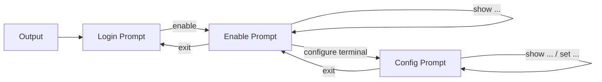
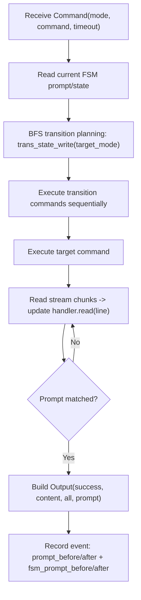

# rneter

[](https://crates.io/crates/rneter)
[](https://docs.rs/rneter)
[](https://opensource.org/licenses/MIT)

[中文文档](README_zh.md)

`rneter` is a Rust library for managing SSH connections to network devices and Linux hosts with an explicit prompt-state-machine execution model. Its design is inspired by libraries such as [Netmiko](https://github.com/ktbyers/netmiko), [Scrapli](https://github.com/carlmontanari/scrapli), and [OpenSecFlow/netdriver](https://github.com/OpenSecFlow/netdriver), and it serves a similar problem space, while focusing more heavily on formal state transitions, reusable interactive flows, transactions, and replayable automation workflows.

## Table of Contents

- [Features](#features)
- [Installation](#installation)
- [Quick Start](#quick-start)
- [Linux Server Management](#linux-server-management)
- [File Transfers](#file-transfers)
- [Command Flows and Interaction](#command-flows-and-interaction)
- [Connection Security](#connection-security)
- [SSH Authentication](#ssh-authentication)
- [Session Recording and Replay](#session-recording-and-replay)
- [Transaction Workflows](#transaction-workflows)
- [Testing With Fake Devices (testkit)](#testing-with-fake-devices-testkit)
- [Template and State-Machine Ecosystem](#template-and-state-machine-ecosystem)
- [Architecture](#architecture)
- [Lifecycle Hooks](#lifecycle-hooks)
- [Template Autodetect](#template-autodetect)
- [Comparison With Netmiko And Scrapli](#comparison-with-netmiko-and-scrapli)
- [Supported Device Types](#supported-device-types)
- [Configuration](#configuration)
- [Error Handling](#error-handling)
- [Documentation](#documentation)
- [License](#license)
- [Contributing](#contributing)
- [Author](#author)

## Features

- **Connection Pooling**: Automatically caches and reuses SSH connections for better performance
- **Flexible SSH Authentication**: Password, private key (inline or file), ssh-agent, and keyboard-interactive authentication through `SshAuthMethod`
- **State Machine Management**: Intelligent device state tracking and automatic transitions
- **Prompt Detection**: Automatic prompt recognition and handling across different device types
- **Mode Switching**: Seamless transitions between device modes (user mode, enable mode, config mode, etc.)
- **Lifecycle Hooks**: Declarative setup and cleanup operations after connect, before disconnect, and around state transitions
- **Template Autodetect**: Rank built-in templates by scored probe matches before creating a full state-machine session
- **SFTP File Uploads**: Upload local files to remote hosts that expose the SSH `sftp` subsystem
- **Multiline Commands**: Split newline-separated command text into independently tracked device operations or preserve it as one command
- **Full Output Diagnostics**: Inspect echoed commands and device syntax-error context through `Output.all`
- **Maximum Compatibility**: Supports a wide range of SSH algorithms including legacy protocols for older devices
- **Async/Await**: Built on Tokio for high-performance asynchronous operations
- **Error Handling**: Comprehensive error types with detailed context
- **Virtual Device Testkit**: Optional `testkit` feature with in-process fake SSH devices imitating every built-in template, for testing rneter-based automation without real hardware

## Installation

Add this to your `Cargo.toml`:

```toml
[dependencies]
rneter = "0.4.7"
```

## Quick Start

Connect with a built-in template and execute one command:

```rust
use rneter::session::{Command, ConnectionRequest, ExecutionContext, MANAGER};
use rneter::templates;

#[tokio::main]
async fn main() -> Result<(), Box<dyn std::error::Error>> {
    let output = MANAGER
        .execute_command_with_context(
            ConnectionRequest::new(
                "admin".to_string(),
                "192.168.1.1".to_string(),
                22,
                "password".to_string(),
                None,
                templates::cisco()?,
            ),
            Command {
                mode: "Enable".to_string(), // Cisco template uses "Enable" mode
                command: "show version".to_string(),
                timeout: Some(60),
                ..Command::default()
            },
            ExecutionContext::default(),
        )
        .await?;

    println!("Command successful: {}", output.success);
    println!("Output: {}", output.content);
    Ok(())
}
```

The following sections cover Linux hosts, transfers, interactive command flows, security, recording, and transactions independently.

## Linux Server Management

`rneter` supports Linux server management with flexible privilege escalation:

```rust
use rneter::session::{ConnectionRequest, ExecutionContext, MANAGER, Command, CmdJob};
use rneter::templates;

#[tokio::main]
async fn main() -> Result<(), Box<dyn std::error::Error>> {
    let handler = templates::linux()?;

    // Connect to Linux server
    let sender = MANAGER
        .get_with_context(
            ConnectionRequest::new(
                "user".to_string(),
                "192.168.1.100".to_string(),
                22,
                "ssh_password".to_string(),
                Some("your_privilege_password".to_string()),
                handler,
            ),
            ExecutionContext::default(),
        )
        .await?;

    // Execute command as regular user
    let (tx, rx) = tokio::sync::oneshot::channel();
    sender.send(CmdJob {
        data: Command {
            mode: "User".to_string(),
            command: "ls -la /home".to_string(),
            timeout: Some(30),
            ..Command::default()
        },
        sys: None,
        responder: tx,
    }).await?;
    let output = rx.await??;
    println!("Output: {}", output.content);

    // Execute command with sudo (single command privilege escalation)
    let (tx, rx) = tokio::sync::oneshot::channel();
    sender.send(CmdJob {
        data: Command {
            mode: "User".to_string(),
            command: "sudo systemctl status nginx".to_string(),
            timeout: Some(30),
            ..Command::default()
        },
        sys: None,
        responder: tx,
    }).await?;
    let output = rx.await??;
    println!("Nginx status: {}", output.content);

    // Switch to persistent root shell
    let (tx, rx) = tokio::sync::oneshot::channel();
    sender.send(CmdJob {
        data: Command {
            mode: "Root".to_string(),  // Automatically executes sudo -i
            command: "systemctl restart nginx".to_string(),
            timeout: Some(30),
            ..Command::default()
        },
        sys: None,
        responder: tx,
    }).await?;
    let output = rx.await??;
    println!("Restart result: {}", output.content);

    Ok(())
}
```

The Linux template defaults to `DeviceShellFlavor::Posix`. For a `fish` login shell,
override `DeviceHandlerConfig.command_execution` as shown below.

**Custom Configuration:**

```rust
use rneter::device::{
    DeviceCommandExecutionConfig, DeviceShellFlavor, prompt_rule, transition_rule,
};
use rneter::templates::linux_handler_config;

// Replace the default User -> Root `sudo -i` transition with `sudo -s`.
let mut config = linux_handler_config();
config.edges = vec![
    transition_rule("User", "sudo -s", "Root", false, false),
    transition_rule("Root", "exit", "User", true, false),
];
let handler = config.build()?;

// Custom prompt patterns
let mut config = linux_handler_config();
config.prompt = vec![
    prompt_rule("User", &[r"^myuser@myhost\$\s*$"]),
    prompt_rule("Root", &[r"^root@myhost#\s*$"]),
];
let handler = config.build()?;

// Force fish-compatible exit-status capture
let mut config = linux_handler_config();
config.command_execution = DeviceCommandExecutionConfig::ShellExitStatus {
    marker: "__RNETER_EXIT_CODE__:".to_string(),
    shell_flavor: DeviceShellFlavor::Fish,
};
let handler = config.build()?;
```

The default Linux template uses `sudo -i` for the `User -> Root` edge. Customize
privilege escalation by replacing `DeviceHandlerConfig.edges`. Prompts and command execution
behavior are customized on the same config. Direct root logins are recognized as `Root` from
the prompt and do not execute the edge.

## File Transfers

### SFTP File Uploads

If the remote host enables the SSH `sftp` subsystem, `rneter` can upload local files over the
same authenticated SSH connection:

```rust
use rneter::session::{ConnectionRequest, ExecutionContext, FileUploadRequest, MANAGER};
use rneter::templates;

#[tokio::main]
async fn main() -> Result<(), Box<dyn std::error::Error>> {
    let handler = templates::linux()?;

    MANAGER
        .upload_file_with_context(
            ConnectionRequest::new(
                "user".to_string(),
                "192.168.1.100".to_string(),
                22,
                "ssh_password".to_string(),
                None,
                handler,
            ),
            FileUploadRequest::new(
                "./artifacts/config.backup".to_string(),
                "/tmp/config.backup".to_string(),
            )
            .with_timeout_secs(30)
            .with_buffer_size(16 * 1024)
            .with_progress_reporting(true),
            ExecutionContext::default(),
        )
        .await?;

    Ok(())
}
```

This path requires SFTP support on the remote host. For devices that only expose CLI-driven
transfer commands such as `copy scp:` or `copy tftp:`, callers can build a `CommandFlow` with
command-specific `CommandInteraction` rules and execute it through the generic command-flow API.

## Command Flows and Interaction

Interactive behavior is modeled at two different execution boundaries:

```text
CommandFlow
  -> Command
       -> CommandInteraction
            -> PromptResponseRule
```

- `CommandInteraction` answers prompts while one command is still running and before the device returns its normal prompt.
- `CommandFlow` runs multiple complete commands in declaration order. Each command finishes at a normal device prompt before the next command starts.
- A command inside a flow can define its own `CommandInteraction`, so the two mechanisms compose rather than compete.

| Mechanism | Defines prompt patterns | Defines response values | Lifetime | Use it for |
| --- | --- | --- | --- | --- |
| Template `write` / `input_rule` | Yes | Static value or dynamic key | Entire handler/session | Prompts common to the device family, such as enable or sudo passwords |
| `Command.dyn_params` | No | Yes | Current command only | Temporarily overriding values consumed by template `input_rule`s |
| `Command.interaction` | Yes | Yes | Current command only | Prompts unique to one command, such as filenames and overwrite confirmations |
| `CommandFlow` | No | No | Multiple complete commands | Ordered execution, per-command modes/timeouts, and stop-on-error behavior |

Prompt handling for the currently executing command uses this order:

```text
normal device prompt
  -> command-level interaction rules
  -> template-level write/input rules
  -> continue waiting for output
```

A normal device prompt completes the command, so interaction rules are for intermediate questions, not for starting another command. Runtime interaction regexes are compiled before command execution; invalid patterns return `ConnectError::InvalidCommandInteraction`.

Use `dyn_params` when the template already knows which prompt to match but one command needs a temporary value:

```rust
use rneter::session::{Command, CommandDynamicParams};

let command = Command {
    mode: "Enable".to_string(),
    command: "copy protected-config startup-config".to_string(),
    dyn_params: CommandDynamicParams {
        enable_password: Some("temporary-secret\n".to_string()),
        ..CommandDynamicParams::default()
    },
    ..Command::default()
};
```

Command-level dynamic values and interaction responses are sent as provided. Include a trailing newline when the remote prompt expects the response to be submitted immediately. Dynamic values are restored after the command completes, so they do not permanently replace connection-level values.

Use `CommandInteraction` when the prompt itself belongs only to this command:

```rust
use rneter::session::{Command, CommandInteraction, PromptResponseRule};

let command = Command {
    mode: "Enable".to_string(),
    command: "copy running-config startup-config".to_string(),
    interaction: CommandInteraction::default()
        .push_prompt(PromptResponseRule::new(
            vec![r"(?i)^Destination filename.*\?\s*$".to_string()],
            "\n".to_string(),
        ))
        .push_prompt(PromptResponseRule::new(
            vec![r"(?i)^Overwrite.*\?\s*$".to_string()],
            "yes\n".to_string(),
        )),
    ..Command::default()
};
```

`record_input` controls whether the matched prompt remains in captured output. Keep it `false` for password-like prompts; enable it when the prompt is useful non-sensitive context.

### Multiline Commands

Commands carry their own multiline strategy. `SplitLines` is the default: every non-empty trimmed
line becomes an independent command with its own prompt and output. Use
`execute_multiline_command_with_context(...)` when the result may contain multiple steps.

```rust
use rneter::session::{
    Command, ConnectionRequest, ExecutionContext, MANAGER, MultilineMode,
};
use rneter::templates;

let result = MANAGER
    .execute_multiline_command_with_context(
        ConnectionRequest::new(
            "admin".to_string(),
            "192.168.1.1".to_string(),
            22,
            "password".to_string(),
            None,
            templates::cisco()?,
        ),
        Command {
            mode: "Enable".to_string(),
            command: "show version\nshow inventory\nshow interfaces".to_string(),
            timeout: Some(60),
            ..Command::default()
        },
        ExecutionContext::default(),
    )
    .await?;

for step in &result.steps {
    println!(
        "step={} command={} success={} output={}",
        step.step_index, step.operation_summary, step.success, step.content
    );
}
```

Set `.with_multiline_mode(MultilineMode::Whole)` on the command for a heredoc, script block, or
other input that must remain a single command. In that mode `result.steps` contains exactly one
output. A timeout or disconnect returns `SessionOperationExecutionError`; completed lines remain
available through `partial_output()`.

### Custom Interactive Command Flows

If a device workflow needs multiple complete commands, build a `CommandFlow` directly and attach runtime `PromptResponseRule`s to the steps that contain intermediate questions. A flow executes on one live connection, supports a separate mode and timeout for each command, stops on the first unsuccessful step by default, and can be bounded with `with_max_steps(...)`:

```rust
use rneter::session::{
    Command, CommandFlow, CommandInteraction, ConnectionRequest, ExecutionContext, MANAGER,
    PromptResponseRule,
};
use rneter::templates;

#[tokio::main]
async fn main() -> Result<(), Box<dyn std::error::Error>> {
    let flow = CommandFlow::new(vec![Command {
        mode: "Enable".to_string(),
        command: "copy http: flash:/image.bin".to_string(),
        timeout: Some(600),
        interaction: CommandInteraction::default()
            .push_prompt(PromptResponseRule::new(
                vec![r"(?i)^Address or name of remote host.*\?\s*$".to_string()],
                "203.0.113.10\n".to_string(),
            ))
            .push_prompt(PromptResponseRule::new(
                vec![r"(?i)^Source (?:file ?name|filename).*\?\s*$".to_string()],
                "/pub/image.bin\n".to_string(),
            ))
            .push_prompt(
                PromptResponseRule::new(
                    vec![r"(?i)^Destination (?:file ?name|filename).*\?\s*$".to_string()],
                    "\n".to_string(),
                )
                .with_record_input(true),
            ),
        ..Command::default()
    },
    Command {
        mode: "Enable".to_string(),
        command: "verify /md5 flash:/image.bin".to_string(),
        timeout: Some(300),
        ..Command::default()
    }])
    .with_stop_on_error(true)
    .with_max_steps(10);

    let result = MANAGER
        .execute_command_flow_with_context(
            ConnectionRequest::new(
                "admin".to_string(),
                "192.168.1.1".to_string(),
                22,
                "password".to_string(),
                None,
                templates::cisco()?,
            ),
            flow,
            ExecutionContext::default(),
        )
        .await?;

    if let Some(last) = result.outputs.last() {
        println!("Last step output: {}", last.content);
    }
    Ok(())
}
```

Runtime prompt-response rules are evaluated before template static input rules, so new SCP/TFTP/HTTP
style wizards can usually be added without changing the underlying template definition.
After each command reaches its normal prompt, the flow continues to the next step in declaration
order. Each step produces an independent output in `CommandFlowOutput.outputs`.

## Connection Security

`rneter` now supports secure defaults and configurable SSH security levels when connecting:

```rust
use rneter::session::{
    ConnectionRequest, ConnectionSecurityOptions, ExecutionContext, MANAGER,
};
use rneter::templates;

// Secure by default (uses known_hosts verification + strict algorithms)
let _sender = MANAGER
    .get_with_context(
        ConnectionRequest::new(
            "admin".to_string(),
            "192.168.1.1".to_string(),
            22,
            "password".to_string(),
            None,
            templates::cisco()?,
        ),
        ExecutionContext::default(),
    )
    .await?;

// Explicitly choose a security profile
let _sender = MANAGER
    .get_with_context(
        ConnectionRequest::new(
            "admin".to_string(),
            "192.168.1.1".to_string(),
            22,
            "password".to_string(),
            None,
            templates::cisco()?,
        ),
        ExecutionContext::new()
            .with_security_options(ConnectionSecurityOptions::legacy_compatible()),
    )
    .await?;
```

## SSH Authentication

Password authentication remains the default through `ConnectionRequest::new(...)`.
For other methods, build the request with `ConnectionRequest::new_with_auth(...)`
and an `SshAuthMethod`:

```rust
use rneter::session::{
    ConnectionRequest, ExecutionContext, MANAGER, SshAuthMethod,
};
use rneter::templates;

// Private key (inline OpenSSH/PEM contents)
let auth = SshAuthMethod::private_key(
    std::fs::read_to_string("/home/ops/.ssh/id_ed25519")?,
    None, // optional passphrase
);
let _sender = MANAGER
    .get_with_context(
        ConnectionRequest::new_with_auth(
            "admin".to_string(),
            "192.168.1.1".to_string(),
            22,
            auth,
            None,
            templates::cisco()?,
        ),
        ExecutionContext::default(),
    )
    .await?;

// Private key file path (loaded at connect time)
let auth = SshAuthMethod::private_key_file("/home/ops/.ssh/id_ed25519", None);

// Local ssh-agent (Unix only)
#[cfg(not(target_os = "windows"))]
let auth = SshAuthMethod::agent();

// Keyboard-interactive: answer any server prompt that contains the fragment
let auth = SshAuthMethod::keyboard_interactive(vec![
    ("Password".to_string(), "secret".to_string()),
    ("OTP".to_string(), "123456".to_string()),
]);
```

Autodetect uses the same model through `DetectRequest::new_with_auth(...)`.
Cached connections include the authentication method in their parameter
fingerprint, so changing credentials always forces a fresh connection.

## Session Recording and Replay

```rust
use rneter::session::{
    ConnectionRequest, ExecutionContext, MANAGER, SessionRecordLevel, SessionReplayer,
};
use rneter::templates;

let (sender, recorder) = MANAGER
    .get_with_recording_level_and_context(
        ConnectionRequest::new(
            "admin".to_string(),
            "192.168.1.1".to_string(),
            22,
            "password".to_string(),
            None,
            templates::cisco()?,
        ),
        ExecutionContext::default(),
        SessionRecordLevel::Full,
    )
    .await?;

// Subscribe to future recorder events in real time
let mut rx = recorder.subscribe();
tokio::spawn(async move {
    while let Ok(entry) = rx.recv().await {
        println!("live event: {:?}", entry.event);
    }
});

// Or record key events only (no raw shell chunks)
let (_sender2, _recorder2) = MANAGER
    .get_with_recording_level_and_context(
        ConnectionRequest::new(
            "admin".to_string(),
            "192.168.1.1".to_string(),
            22,
            "password".to_string(),
            None,
            templates::cisco()?,
        ),
        ExecutionContext::default(),
        SessionRecordLevel::KeyEventsOnly,
    )
    .await?;

// ...send CmdJob through `sender`...

// Export recording as JSONL
let jsonl = recorder.to_jsonl()?;

// Restore and replay offline
let restored = rneter::session::SessionRecorder::from_jsonl(&jsonl)?;
let mut replayer = SessionReplayer::from_recorder(&restored);
let replayed_output = replayer.replay_next("show version")?;
println!("Replayed output: {}", replayed_output.content);

// Offline command-flow testing without real SSH
let script = vec![
    rneter::session::Command {
        mode: "Enable".to_string(),
        command: "terminal length 0".to_string(),
        timeout: None,
        ..rneter::session::Command::default()
    },
    rneter::session::Command {
        mode: "Enable".to_string(),
        command: "show version".to_string(),
        timeout: None,
        ..rneter::session::Command::default()
    },
];
let outputs = replayer.replay_script(&script)?;
assert_eq!(outputs.len(), 2);
```

For CI-style offline tests, store JSONL recordings under `tests/fixtures/` and replay them in integration tests (see `tests/replay_fixtures.rs`). Normalize noisy online recordings into stable fixtures with:

```bash
cargo run --example normalize_fixture -- raw_session.jsonl tests/fixtures/session_new.jsonl
```

## Transaction Workflows

Transactions organize state-changing automation into four layers:

```text
SessionOperation -> TxStep -> TxBlock -> TxWorkflow
```

- `SessionOperation` is one concrete executable unit: a `Command` or `CommandFlow`.
- `TxStep` pairs a forward operation with an optional compensating operation.
- `TxBlock` executes related steps in order under one explicit rollback policy.
- `TxWorkflow` executes multiple blocks and compensates previously committed blocks in reverse order when a later block fails.

These are application-level compensating transactions, not database transactions. Commands already accepted by a device are not atomically undone, and rollback operations can also fail. Transaction behavior is never inferred from command text: callers explicitly select the policy and provide the compensating operations required by that policy.

### Rollback Policies

| Policy | Behavior | Typical use |
| --- | --- | --- |
| `RollbackPolicy::None` | Never attempts rollback | Read-only work or changes intentionally managed outside rneter |
| `RollbackPolicy::WholeResource` | Runs one block-level compensating operation | Create/update workflows that can be reverted with one operation |
| `RollbackPolicy::PerStep` | Runs available compensating operations in reverse order | Multi-step changes where steps have independent inverse operations |

For `WholeResource`, `trigger_step_index` identifies the forward step that must complete before rollback is valid. For `PerStep`, `rollback_on_failure` controls whether the failed step's own compensation is attempted; previously successful steps are still considered in reverse execution order.

```rust
let block = TxBlock {
    name: "interface-update".to_string(),
    rollback_policy: RollbackPolicy::PerStep,
    steps: vec![
        TxStep::new(Command {
            mode: "Config".to_string(),
            command: "interface ethernet 1/1".to_string(),
            ..Command::default()
        }),
        TxStep::new(Command {
            mode: "Config".to_string(),
            command: "description uplink".to_string(),
            ..Command::default()
        })
        .with_rollback(Command {
            mode: "Config".to_string(),
            command: "no description".to_string(),
            ..Command::default()
        })
        .with_rollback_on_failure(true),
    ],
    fail_fast: true,
};
```

Steps without a rollback operation are valid under `PerStep`; they are reported as skipped when no compensation can be planned.

### Failure Sequence

With the recommended `fail_fast: true`, failure handling follows this order:

```text
forward step fails
  -> stop the current block
  -> run the current block's rollback policy
  -> mark the workflow failed
  -> compensate earlier committed blocks in reverse order
  -> return forward and rollback results separately
```

At block level, `fail_fast` stops remaining steps after the first failure. At workflow level, it stops starting later blocks after the first failed block. Keep it enabled for all-or-nothing workflows.

### Build and Execute a Block

The following block creates an address object. If a later step fails after step `0` succeeds, the whole-resource rollback removes the object:

```rust
use rneter::session::{
    Command, CommandFlow, ConnectionRequest, ExecutionContext, MANAGER,
    RollbackPolicy, TxBlock, TxStep,
};
use rneter::templates;

let block = TxBlock {
    name: "addr-create".to_string(),
    rollback_policy: RollbackPolicy::WholeResource {
        rollback: Box::new(
            Command {
                mode: "Config".to_string(),
                command: "no object network WEB01".to_string(),
                timeout: Some(30),
                ..Command::default()
            }
            .into(),
        ),
        trigger_step_index: 0,
    },
    steps: vec![
        TxStep::new(Command {
            mode: "Config".to_string(),
            command: "object network WEB01".to_string(),
            timeout: Some(30),
            ..Command::default()
        }),
        TxStep::new(CommandFlow::new(vec![
            Command {
                mode: "Config".to_string(),
                command: "host 10.0.0.10".to_string(),
                timeout: Some(30),
                ..Command::default()
            },
            Command {
                mode: "Config".to_string(),
                command: "description WEB01".to_string(),
                timeout: Some(30),
                ..Command::default()
            },
        ])),
    ],
    fail_fast: true,
};

let result = MANAGER
    .execute_tx_block_with_context(
        ConnectionRequest::new(
            "admin".to_string(),
            "192.168.1.1".to_string(),
            22,
            "password".to_string(),
            None,
            templates::cisco()?,
        ),
        block,
        ExecutionContext::default(),
    )
    .await?;
println!(
    "committed={}, rollback_succeeded={}",
    result.committed, result.rollback_succeeded
);
```

### Step Operations

`TxStep::new(...)` accepts either a command or a concrete `CommandFlow`:

Commands containing multiple lines are expanded automatically according to `Command.multiline_mode`.
The default `SplitLines` strategy makes every non-empty line a child operation inside the same
transaction step; set `Whole` when the text must remain one command.

```rust
let verify_step = TxStep::new(Command {
    mode: "Enable".to_string(),
    command: "show running-config\nshow startup-config".to_string(),
    ..Command::default()
});

let summary = verify_step.run.summary()?;
println!(
    "kind={} mode={} steps={} desc={}",
    summary.kind, summary.mode, summary.step_count, summary.description
);
```

### Multi-Block Workflows

Use `TxWorkflow` for ordered blocks such as addresses -> services -> policy. If a block fails, its own rollback policy runs first; previously committed blocks are then compensated in reverse order according to their policies.

```rust
use rneter::session::{TxWorkflow, TxWorkflowResult};

let workflow = TxWorkflow {
    name: "fw-policy-publish".to_string(),
    blocks: vec![addr_block, svc_block, policy_block],
    fail_fast: true,
};

let workflow_result: TxWorkflowResult = MANAGER
    .execute_tx_workflow_with_context(
        ConnectionRequest::new(
            "admin".to_string(),
            "192.168.1.1".to_string(),
            22,
            "password".to_string(),
            None,
            templates::cisco()?,
        ),
        workflow,
        ExecutionContext::default(),
    )
    .await?;

for block in &workflow_result.block_results {
    for step in &block.step_results {
        println!(
            "step[{}] op={} execution={:?} rollback={:?}",
            step.step_index,
            step.operation_summary,
            step.execution_state,
            step.rollback_state
        );
        for child in &step.forward_operation_steps {
            println!(
                "  forward_step[{}] op={} success={}",
                child.step_index, child.operation_summary, child.success
            );
        }
        for child in &step.rollback_operation_steps {
            println!(
                "  rollback_step[{}] op={} success={}",
                child.step_index, child.operation_summary, child.success
            );
        }
    }
    if let Some(block_rollback) = &block.block_rollback_operation_summary {
        println!("block_rollback={block_rollback}");
        for child in &block.block_rollback_steps {
            println!(
                "  block_rollback_step[{}] op={} success={}",
                child.step_index, child.operation_summary, child.success
            );
        }
    }
}
```

### Inspect Results

`TxResult` and `TxWorkflowResult` retain both forward and rollback details:

- Block outcome: `committed`, `failed_step`, `failure_reason`
- Rollback outcome: `rollback_attempted`, `rollback_succeeded`, `rollback_errors`
- Step outcome: `execution_state`, `failure_reason`, `rollback_state`, `rollback_reason`
- Nested operation output: `forward_operation_steps`, `rollback_operation_steps`, `block_rollback_steps`

This allows callers to distinguish a failed forward operation, a skipped rollback, and a rollback that was attempted but failed.

### Convenience Builder

`templates::build_tx_block` only converts a list of command strings into `TxStep` values. The caller must explicitly select the transaction rollback behavior through `RollbackPolicy`:

```rust
use rneter::session::{Command, RollbackPolicy};

let cmds = vec![
    "object network WEB01".to_string(),
    "host 10.0.0.10".to_string(),
];
let block = templates::build_tx_block(
    "addr-create",
    "Config",
    &cmds,
    Some(30),
    RollbackPolicy::WholeResource {
        rollback: Box::new(Command {
            mode: "Config".to_string(),
            command: "no object network WEB01".to_string(),
            timeout: Some(30),
            ..Command::default()
        }.into()),
        trigger_step_index: 0,
    },
)?;
```

### Operational Guidance

- Keep compensating operations idempotent so retries do not create additional damage.
- Use `trigger_step_index` only after the resource addressed by the rollback is known to exist.
- Set `rollback_on_failure` only when a partially applied failed step is safe to compensate.
- Treat rollback failure as a separate operational incident; a failed transaction is not necessarily restored.
- Validate blocks and workflows before execution when constructing them manually.
- Use session recording for audit trails and offline replay of forward/rollback behavior.

### Recording and Audit

When session recording is enabled, transaction execution emits block, step, rollback, and workflow lifecycle events. Key event kinds include `tx_block_started`, `tx_step_succeeded`, `tx_step_failed`, `tx_rollback_started`, `tx_rollback_step_succeeded`, `tx_rollback_step_failed`, `tx_block_finished`, `tx_workflow_started`, and `tx_workflow_finished`.

```json
{
  "kind": "tx_block_finished",
  "block_name": "addr-create",
  "committed": false,
  "rollback_attempted": true,
  "rollback_succeeded": true
}
```

Use `SessionRecordLevel::KeyEventsOnly` when lifecycle outcomes are sufficient, or `Full` when raw chunks and detailed command output are required for diagnosis.

## Testing With Fake Devices (testkit)

The optional `testkit` feature ships an in-process fake SSH device so that
applications built on `rneter` can test their automation logic without real
hardware. The fake device is a real SSH server (powered by `russh`, with a
throwaway host key generated at spawn) that serves a scripted CLI, so the
full stack is exercised: handshake, prompt detection, state transitions,
lifecycle hooks, recording, and transactions.

Enable it in your `dev-dependencies`:

```toml
[dev-dependencies]
rneter = { version = "0.4.7", features = ["testkit"] }
```

Every built-in template has a ready-made persona. The simulated state machine
is derived from the same `DeviceHandlerConfig` as the client template, so the
fake device can never silently diverge from the template it impersonates:

```rust
use rneter::session::{Command, SshConnectionManager};
use rneter::testkit::{DevicePersona, FakeSshDevice};

#[tokio::test]
async fn my_automation_works_on_cisco() -> Result<(), Box<dyn std::error::Error>> {
    let device = FakeSshDevice::spawn(DevicePersona::builtin("cisco_ios")?).await?;
    let manager = SshConnectionManager::new();

    let output = manager
        .execute_command_with_context(
            device.connection_request()?,
            Command {
                mode: "Enable".to_string(),
                command: "show version".to_string(),
                ..Command::default()
            },
            device.execution_context(),
        )
        .await?;
    assert!(output.success);

    // Assert from the device's point of view: which commands actually arrived.
    assert!(device.received_commands().contains(&"show version".to_string()));
    Ok(())
}
```

Useful entry points:

- `DevicePersona::builtin(name)` — personas for all built-in templates that
  imitate the real device: hostname-styled prompts (`Router#`, `<HUAWEI>`,
  `FGT60F #`, ...), realistic replies for the vendor's version command
  (`show version`, `display version`, `get system status`, ...),
  enable/sudo password challenges, and vendor-styled error output
  (triggered by sending `testkit::ERROR_COMMAND`).
- `DevicePersona::with_canned_reply(command, output)` — add more realistic
  command replies to any persona.
- `DevicePersona::for_config(...)` — simulate a custom
  `DeviceHandlerConfig`; add challenges and error text with the builder
  methods.
- `FakeSshDevice::received_commands()` — the device-side command log, ideal
  for asserting transition ordering and transaction rollbacks.
- `device.connection_request()` / `device.execution_context()` — pre-wired
  connection parameters for the spawned device.
- `FakeSshDevice::spawn_on(persona, addr)` — bind to a well-known port so
  external processes (or a plain `ssh` client) can connect.
- `builtin_personas()` — every built-in persona at once, for fleets and
  matrix tests.

### Default Credentials

| Item | Constant | Value |
| --- | --- | --- |
| Login username | `DEFAULT_USERNAME` | `admin` |
| Login password | `DEFAULT_PASSWORD` | `testkit-login-pw` |
| Enable/sudo password | `DEFAULT_ENABLE_PASSWORD` | `testkit-enable-pw` |

All of these are public persona fields and can be overridden.

### How a Virtual Device Behaves

- **State transitions**: template transition commands (`enable`,
  `system-view`, `configure terminal`, ...) switch the prompt according to
  the state machine; password-protected transitions issue a challenge
  first (`Password:`, `[sudo] password for admin:`, ...) and verify the
  response.
- **Simulated commands**: commands known to the persona (built-in or added
  via `with_canned_reply`) return realistic multi-line vendor output.
- **Unknown commands**: return `benign_reply`
  (default `testkit-ok sample output`) and count as successful, so tests
  can send arbitrary configuration commands.
- **`make-error`** (`testkit::ERROR_COMMAND`): returns the vendor-styled
  error line (exit code 1 on the linux persona) for exercising error
  detection and transaction rollback paths.
- **Line endings**: both the `\n` sent by automation clients and the bare
  `\r` sent by interactive SSH terminals are accepted, so you can log in
  with plain `ssh` for manual debugging.
- Note: output lines equal to (or a prefix of) the sent command are
  filtered from `Output.content` by rneter's echo filter (e.g. the leading
  `!Command: ...` line of NX-OS); read `Output.all` for raw data.

### Prompts and Simulated Commands per Built-in Persona

| Template | Prompt style | Simulated commands |
| --- | --- | --- |
| `cisco_ios` / `cisco_xe` | `Router>` `Router#` `Router(config)#` | `show version` · `show running-config` · `show ip interface brief` |
| `cisco_asa` | `ciscoasa>` `ciscoasa#` | `show version` · `show running-config` · `show interface ip brief` |
| `cisco_nxos` | `switch>` `switch#` | `show version` · `show running-config` · `show interface brief` |
| `arista_eos` | `switch>` `switch#` | `show version` · `show running-config` · `show interfaces status` |
| `aruba_aoscx` | `switch>` `switch#` | `show version` · `show running-config` · `show interface brief` |
| `dell_os10` | `OS10>` `OS10#` | `show version` · `show running-configuration` · `show interface status` |
| `juniper_junos` | `admin@SRX>` `admin@SRX#` | `show version` · `show configuration` · `show interfaces terse` |
| `fortinet` | `FGT60F #` | `get system status` · `show system interface` · `get system performance status` |
| `paloalto_panos` | `admin@PA-3220>` `admin@PA-3220#` | `show system info` · `show config running` · `show interface all` |
| `checkpoint_gaia` | `gw-13800b>` | `show version all` · `show configuration` · `show interfaces all` |
| `huawei` | `<HUAWEI>` `[HUAWEI]` | `display version` · `display current-configuration` · `display interface brief` |
| `h3c_comware` / `hp_comware` | `<H3C>` `[H3C]` | `display version` · `display current-configuration` · `display interface brief` |
| `hillstone_stoneos` | `SG-6000#` `SG-6000(config)#` | `show version` · `show configuration` · `show interface` |
| `topsec` | `TopsecOS#` | `system version show` · `system config show` · `network interface show` |
| `dptech` | `<DPTECH>` `[DPTECH]` | `show version` · `show running-config` · `show interface brief` |
| `qianxin` | `QiAnXin>` `QiAnXin-config]` | `show version` · `show running-config` · `show interface` |
| `venustech` | `USG>` `USG#` | `show version` · `show running-config` · `show interface` |
| `chaitin` | `safeline>` `safeline#` | `show version` · `show running-config` · `show interface` |
| `zte_zxros` | `ZXR10>` `ZXR10#` | `show version` · `show running-config` · `show ip interface brief` |
| `maipu` | `MyPower>` `MyPower#` | `show version` · `show running-config` · `show ip interface brief` |
| `ruijie_os` | `Ruijie>` `Ruijie#` | `show version` · `show running-config` · `show ip interface brief` |
| `array` | `AN>` `AN#` + virtual site `vs1$` | `show version` · `show running-config` · `show interface` |
| `linux` | `admin@debian:~$` `root@debian:~#` | `uname -a` · `ip -brief address` · `cat /etc/os-release` |

Virtual devices can also run as standalone servers via the bundled example —
one per built-in template, or a self-defined one:

```bash
# List every built-in device persona
cargo run --example virtual_device --features testkit -- --list

# Run one virtual device on a fixed port
cargo run --example virtual_device --features testkit -- cisco_ios 2201

# Run a fleet: one virtual device per built-in template (ports 2200..2224)
cargo run --example virtual_device --features testkit -- --all 2200

# Run a self-defined device type (custom prompts/transitions/errors)
cargo run --example virtual_device --features testkit -- --custom 2300

# Then, from any terminal:
ssh -p 2201 admin@127.0.0.1   # password: testkit-login-pw
```

## Template and State-Machine Ecosystem

You can manage built-in templates as a catalog and run state-graph diagnostics:

```rust
use rneter::templates;

let names = templates::available_templates();
assert!(names.contains(&"cisco_ios"));

let _handler = templates::by_name("juniper_junos")?; // case-insensitive, legacy aliases still work

let report = templates::diagnose_template("cisco_ios")?;
println!("has issues: {}", report.has_issues());
println!("dead ends: {:?}", report.dead_end_states);

let catalog = templates::template_catalog();
println!("template count: {}", catalog.len());

let all_json = templates::diagnose_all_templates_json()?;
println!("all diagnostics json bytes: {}", all_json.len());
```

You can also export a built-in template configuration, extend it, and build your own handler:

```rust
use rneter::device::prompt_rule;
use rneter::templates;

let mut config = templates::by_name_config("cisco_ios")?;
config
    .prompt
    .push(prompt_rule("CustomMode", &[r"^custom>\s*$"]));

let handler = config.build()?;
assert!(handler.states().iter().any(|state| state == "custommode"));
```

New recording/replay capabilities:

- Prompt tracking: each `command_output` now records both `prompt_before`/`prompt_after`
- FSM prompt tracking: each event can include `fsm_prompt_before`/`fsm_prompt_after`
- Output prompt: command/replay results now include `Output.prompt`
- Schema compatibility: legacy `connection_established` fields (`prompt`/`state`) remain readable
- Fixture quality workflow: `tests/fixtures/` includes success/failure/state-switch samples and snapshot checks in `tests/replay_fixtures.rs`

Example `command_output` event shape:

```json
{
  "kind": "command_output",
  "command": "show version",
  "mode": "Enable",
  "prompt_before": "router#",
  "prompt_after": "router#",
  "fsm_prompt_before": "enable",
  "fsm_prompt_after": "enable",
  "success": true,
  "content": "Version 1.0",
  "all": "show version\nVersion 1.0\nrouter#"
}
```

## Architecture

### Connection Management

The `SshConnectionManager` provides a singleton connection pool accessible via the `MANAGER` constant. It automatically:

- Caches connections for 5 minutes of inactivity
- Reconnects on connection failure
- Manages up to 100 concurrent connections

### State Machine

The `DeviceHandler` implements a finite state machine that:

- Tracks the current device state using regex patterns
- Finds optimal paths between states using BFS
- Handles automatic state transitions
- Supports system-specific states (e.g., different VRFs or contexts)

#### Design Rationale

The state machine is designed around two stable facts in network-device automation:

1. Prompts are more reliable than command text for identifying current mode.
2. Transition paths vary by vendor/model, so pathfinding must be data-driven.

Core design choices:

- Normalize states to lowercase and map prompt regex matches to state indexes for fast lookups.
- Separate prompt detection (`read_prompt`) from state update (`read`) to keep command loops predictable.
- Model transitions as a directed graph (`edges`) and use BFS to find shortest valid mode switch path.
- Keep dynamic input handling (`read_need_write`) independent from command logic, so password/confirm flows are reusable.
- Track both CLI prompt text and FSM prompt (state name) to support online diagnostics and offline replay assertions.

Benefits:

- Better portability: vendor-specific behavior is mostly data configuration, not hard-coded branches.
- Better resilience: command execution relies on prompt/state convergence instead of fixed output formats.
- Better testability: record/replay can validate state transitions and prompt evolution without real SSH sessions.

#### State Transition Model


```mermaid
flowchart LR
    O["Output"] --> L["Login Prompt"]
    L -->|enable| E["Enable Prompt"]
    E -->|configure terminal| C["Config Prompt"]
    C -->|exit| E
    E -->|exit| L
    E -->|show ...| E
    C -->|show ... / set ...| C
```

#### Command Execution Flow (State-Aware)


```mermaid
flowchart TD
    A["Receive Command(mode, command, timeout)"] --> B["Read current FSM prompt/state"]
    B --> C["BFS transition planning: trans_state_write(target_mode)"]
    C --> D["Execute transition commands sequentially"]
    D --> E["Execute target command"]
    E --> F["Read stream chunks -> update handler.read(line)"]
    F --> G{"Prompt matched?"}
    G -->|No| F
    G -->|Yes| H["Build Output(success, content, all, prompt)"]
    H --> I["Record event: prompt_before/after + fsm_prompt_before/after"]
```

### Command Execution

Commands are executed through an async channel-based architecture:

1. Submit a `CmdJob` to the connection sender
2. The library automatically transitions to the target state if needed
3. Executes the command and waits for the prompt
4. Returns the output with success status

Mode names supplied by callers are normalized to lowercase internally, so `"Enable"`, `"enable"`, and `"ENABLE"` target the same FSM state.

## Lifecycle Hooks

`rneter` now supports declarative lifecycle hooks through `DeviceHandlerConfig.hooks`:

- `after_connect`
- `before_disconnect`
- `after_enter_state`
- `before_exit_state`

Hooks reuse `SessionOperation`, so they can run either a single command or a command flow. In `0.4.4`, connection-level hooks are template-scoped so they remain stable under connection caching, while state-scoped hooks are normalized against the internal lowercase FSM state names.

Built-in templates can ship sensible defaults. For example:

- Cisco/ASA runs `terminal pager 0` after connect
- Juniper runs `set cli screen-length 0` after connect

Hook output does not get merged into the parent command result, but hook lifecycle events are recorded by the session recorder.

## Template Autodetect

`rneter` can now score built-in templates before you commit to a concrete `DeviceHandler`.

The autodetect result is a ranked report, not a single opaque answer:

- `best_match`
- `candidates`
- `raw_facts`

This makes it easier to understand why a device looks like Cisco IOS/IOS-XE, Juniper Junos, Huawei, H3C/HP Comware, Linux, Arista EOS, Aruba AOS-CX, Cisco ASA/NX-OS, Dell OS10, Ruijie OS, ZTE ZXROS, Fortinet, Palo Alto PAN-OS, or Check Point Gaia, and to debug ambiguous results in mixed environments.

Current scope:

- SSH only
- built-in templates currently covered: `cisco_ios`, `cisco_xe`, `juniper_junos`, `huawei`, `h3c_comware`, `hp_comware`, `linux`, `hillstone_stoneos`, `arista_eos`, `aruba_aoscx`, `cisco_asa`, `cisco_nxos`, `dell_os10`, `fortinet`, `paloalto_panos`, `ruijie_os`, `zte_zxros`, `checkpoint_gaia`
- legacy rneter names such as `cisco`, `juniper`, `h3c`, `hillstone`, `arista`, `paloalto`, `ruijie`, and `checkpoint` remain accepted as aliases
- `cisco_asa` is exposed as a distinct template name and autodetect target, but it currently reuses the proven `cisco_ios` handler behavior
- probe-driven scoring using initial prompt/output plus cached read-only probe commands

How to read the diagnostics:

- `raw_facts` now includes both positive matches and probe-level error matches.
- A positive fact means a prompt or probe output matched a scoring regex and contributed weight.
- An error fact means the probe output matched an invalid-command pattern such as `Invalid input`, `Unrecognized command`, or `command not found`; that probe is then ignored for scoring, similar to Netmiko's autodetect behavior.
- This makes it easier to tell the difference between "this device does not look like Cisco" and "the Cisco probe command was not accepted here".

Example shape:

```rust
use rneter::session::{DetectRequest, ExecutionContext};
use rneter::templates::autodetect_with_context;

# async fn demo() -> Result<(), Box<dyn std::error::Error>> {
let report = autodetect_with_context(
    DetectRequest::new(
        "admin".to_string(),
        "192.168.1.1".to_string(),
        22,
        "password".to_string(),
    ),
    ExecutionContext::default(),
)
.await?;

if let Some(best) = &report.best_match {
    println!("best template: {} ({:?}, score={})", best.template_name, best.confidence, best.score);
}

for candidate in &report.candidates {
    println!("candidate: {} score={}", candidate.template_name, candidate.score);
}
# Ok(())
# }
```

You can also continue directly into a live connection when the best candidate
meets a minimum confidence threshold:

```rust
use rneter::session::{ExecutionContext, DetectRequest};
use rneter::templates::{
    autodetect_and_connect_with_context, DetectConnectPolicy,
};

# async fn demo() -> Result<(), Box<dyn std::error::Error>> {
let connected = autodetect_and_connect_with_context(
    DetectRequest::new(
        "admin".to_string(),
        "192.168.1.1".to_string(),
        22,
        "password".to_string(),
    ),
    None,
    ExecutionContext::default(),
    DetectConnectPolicy::default(), // default minimum confidence = Medium
)
.await?;

println!("connected with template: {}", connected.template_name);
# Ok(())
# }
```

If you want caller-defined autodetect targets, provide your own handler config
and detect profile:

```rust
use rneter::device::prompt_rule;
use rneter::device::DeviceHandlerConfig;
use rneter::session::{DetectRequest, ExecutionContext};
use rneter::templates::{
    autodetect_with_templates_and_context, DetectTemplateDefinition,
    TemplateDetectProfile, TemplateProbe, TemplateProbeRule,
};

# async fn demo() -> Result<(), Box<dyn std::error::Error>> {
let custom = DetectTemplateDefinition::new(
    "custom_linux",
    DeviceHandlerConfig {
        prompt: vec![prompt_rule("Root", &[r"^custom#\\s*$"])],
        ..DeviceHandlerConfig::default()
    },
    TemplateDetectProfile {
        initial_rules: vec![TemplateProbeRule {
            pattern: r"^custom#\\s*$".to_string(),
            weight: 20,
        }],
        probes: vec![TemplateProbe {
            command: "show version".to_string(),
            rules: vec![TemplateProbeRule {
                pattern: r"Custom Linux".to_string(),
                weight: 90,
            }],
            error_patterns: Vec::new(),
        }],
    },
);

let report = autodetect_with_templates_and_context(
    DetectRequest::new(
        "admin".to_string(),
        "192.168.1.1".to_string(),
        22,
        "password".to_string(),
    ),
    ExecutionContext::default(),
    vec![custom],
)
.await?;
# Ok(())
# }
```

If you want built-in autodetect coverage plus your own caller-defined templates,
use the merge helper directly:

```rust
use rneter::device::prompt_rule;
use rneter::device::DeviceHandlerConfig;
use rneter::session::{DetectRequest, ExecutionContext};
use rneter::templates::{
    autodetect_with_builtin_and_templates_and_context, DetectTemplateDefinition,
    TemplateDetectProfile, TemplateProbe, TemplateProbeRule,
};

# async fn demo() -> Result<(), Box<dyn std::error::Error>> {
let custom = DetectTemplateDefinition::new(
    "custom_linux",
    DeviceHandlerConfig {
        prompt: vec![prompt_rule("Root", &[r"^custom#\\s*$"])],
        ..DeviceHandlerConfig::default()
    },
    TemplateDetectProfile {
        initial_rules: vec![TemplateProbeRule {
            pattern: r"^custom#\\s*$".to_string(),
            weight: 20,
        }],
        probes: vec![TemplateProbe {
            command: "show version".to_string(),
            rules: vec![TemplateProbeRule {
                pattern: r"Custom Linux".to_string(),
                weight: 90,
            }],
            error_patterns: Vec::new(),
        }],
    },
);

let report = autodetect_with_builtin_and_templates_and_context(
    DetectRequest::new(
        "admin".to_string(),
        "192.168.1.1".to_string(),
        22,
        "password".to_string(),
    ),
    ExecutionContext::default(),
    vec![custom],
)
.await?;
# Ok(())
# }
```

## Comparison With Netmiko And Scrapli

If you are coming from [Netmiko](https://github.com/ktbyers/netmiko) or
[Scrapli](https://github.com/carlmontanari/scrapli), the biggest difference is
where `rneter` puts its abstraction boundary.

- `Netmiko` is primarily a device session toolkit built around prompt-driven command execution.
- `Scrapli` is primarily a transport/channel/driver toolkit built around prompt patterns and privilege levels.
- `rneter` is primarily a prompt-state-machine execution engine built around explicit states, transitions, and reusable operations.

At a high level:

- In `Netmiko`, prompt detection is mainly used to know when command output is complete.
- In `Scrapli`, prompt detection and privilege levels are used to keep the channel aligned with the expected operating mode.
- In `rneter`, prompt detection is used to update a formal state machine, and command execution is a state-convergence process.

### Mechanism Comparison

| Dimension                          | `rneter`                                                                                         | `Netmiko`                                                                                            | `Scrapli`                                                                               | What This Means                                                                                    |
| ---------------------------------- | ------------------------------------------------------------------------------------------------ | ---------------------------------------------------------------------------------------------------- | --------------------------------------------------------------------------------------- | -------------------------------------------------------------------------------------------------- |
| Core abstraction                   | `DeviceHandler` as a finite state machine with prompt rules, input rules, and transition edges   | `BaseConnection` as a prompt-driven session object                                                   | `Driver + Channel + Transport` with platform privilege levels                           | `rneter` models device behavior more explicitly; the others emphasize session interaction first    |
| Prompt role                        | Prompt is a state event and command completion signal                                            | Prompt is mainly a command completion signal                                                         | Prompt is mainly a channel alignment and completion signal                              | `rneter` treats prompt text as control-plane data, not just output framing                         |
| Mode switching                     | Automatic BFS pathfinding over explicit `edges`                                                  | Usually explicit helper methods such as `enable()` / `config_mode()` / `exit_config_mode()`          | Privilege-level acquisition/transition in the driver                                    | `rneter` can generalize arbitrary mode graphs more naturally                                       |
| Interactive input                  | Prompt/input rules are part of the runtime FSM and can be extended per command flow              | Usually handled through timing/expect workflows such as `send_command_timing()` / `send_multiline()` | Usually handled through interactive channel operations and explicit prompt expectations | `rneter` is better suited to reusable interactive device wizards                                   |
| Multi-line / noisy prompt handling | Shared stream normalization, prompt prefix buffering, fragment merge, and prompt matching        | ANSI/backspace stripping plus prompt reads                                                           | Prompt pattern search depth and explicit prompt reads in channel operations             | `rneter` spends more machinery on difficult prompts such as themed shells or JunOS context prompts |
| Error handling                     | Error lines can map into FSM error state and can also be selectively ignored                     | Mostly command-method or output-pattern based                                                        | Mostly response / failed-when / parser-layer handling                                   | `rneter` can fold error semantics into execution flow more directly                                |
| Output model                       | `Output.success`, `content`, `all`, `prompt`, optional exit code, recorder events                | Primarily processed string output, plus helper parsing paths                                         | Response objects with raw/processed output and driver/channel metadata                  | `rneter` is oriented toward orchestration and replay, not only interactive use                     |
| Linux support                      | Linux is handled through the same stateful execution engine, including shell exit-status capture | Not a primary design center                                                                          | Supported, but still channel/prompt-centric                                             | `rneter` can treat network devices and Linux hosts more uniformly                                  |
| Transactions / rollback            | Built-in `TxBlock`, `TxWorkflow`, rollback policies, recorded child-step results                 | Caller-managed                                                                                       | Caller-managed                                                                          | This is one of the biggest architectural differences in favor of `rneter` for automation platforms |
| Replay / fixture testing           | Built-in session recording and replay                                                            | Not a core architectural feature                                                                     | Not a core architectural feature                                                        | `rneter` is designed to support offline testing of CLI automation behavior                         |

### Same Task, Different Mental Model

| Task                           | `Netmiko` mental model                                         | `Scrapli` mental model                                                          | `rneter` mental model                                                            |
| ------------------------------ | -------------------------------------------------------------- | ------------------------------------------------------------------------------- | -------------------------------------------------------------------------------- |
| Run `show version`             | Send a command and read until prompt                           | Send a command through the channel and read until prompt pattern                | Converge to target mode, execute command, and update FSM from returned prompt    |
| Send config commands           | Enter config mode, send commands, optionally exit              | Acquire config privilege level, send configs, later return to desired privilege | Treat config as a named state and route execution there through transition edges |
| Handle `copy scp:` prompts     | Use timing / multiline helpers with expected follow-up prompts | Use interactive send/read operations with explicit prompt expectations          | Build a `CommandFlow` with command-specific `CommandInteraction` rules            |
| Handle `[edit]` + `user@host#` | Tune prompt logic for this platform                            | Tune prompt pattern / channel read behavior                                     | Model `[edit]` as a prompt prefix and merge it into the next prompt candidate    |

### Why This Matters

For a `Netmiko` user, `rneter` will feel less like “a better `send_command`” and
more like “a reusable execution engine that knows what state the device is in”.

For a `Scrapli` user, `rneter` will feel less like “a better driver/channel stack”
and more like “a higher-level state graph built on prompt parsing”.

That is why `rneter` is especially strong when you need:

- multi-step command workflows,
- vendor-specific interactive wizards,
- transaction-style rollback,
- prompt-aware replayable tests,
- or one orchestration layer that spans both network devices and Linux servers.

The tradeoff is that `rneter` asks the caller to think in terms of states,
transitions, and execution models more often than `Netmiko` or `Scrapli`.

## Supported Device Types

The library is designed to work with any SSH-enabled network device and Linux servers. It's particularly well-suited for:

**Network Devices:**

| Template name | Vendor / platform         | Primary modes                            | Notes                                                                         |
| ------------- | ------------------------- | ---------------------------------------- | ----------------------------------------------------------------------------- |
| `cisco`       | Cisco IOS / IOS-XE        | `Login`, `Enable`, `Config`              | Also used as the proven handler behavior for `cisco_asa`                      |
| `cisco_asa`   | Cisco ASA                 | `Login`, `Enable`, `Config`              | Distinct template name and autodetect target; reuses `cisco` handler behavior |
| `cisco_nxos`  | Cisco NX-OS               | `Login`, `Enable`, `Config`              | Cisco-like mode transitions with NX-OS paging defaults                        |
| `juniper`     | Juniper JunOS             | `Enable`, `Config`                       | Supports JunOS edit prompt prefix handling                                    |
| `arista`      | Arista EOS                | `Login`, `Enable`, `Config`              | Cisco-like template for EOS                                                   |
| `aruba_aoscx` | Aruba AOS-CX              | `Login`, `Enable`, `Config`              | Uses AOS-CX paging defaults                                                   |
| `dell_os10`   | Dell OS10                 | `Login`, `Enable`, `Config`              | Cisco-like template for Dell OS10                                             |
| `ruijie`      | Ruijie RGOS               | `Login`, `Enable`, `Config`              | Includes password-change decline prompt handling                              |
| `zte_zxros`   | ZTE ZXROS                 | `Login`, `Enable`, `Config`              | Cisco-like template for ZTE ZXROS                                             |
| `huawei`      | Huawei VRP                | `Enable`, `Config`                       | Uses `system-view` / `return` transitions                                     |
| `h3c`         | H3C Comware               | `Enable`, `Config`                       | Comware-style angle/square-bracket prompts                                    |
| `hillstone`   | Hillstone SG / StoneOS    | `Enable`, `Config`                       | Includes save confirmation prompts                                            |
| `array`       | Array Networks APV        | `Login`, `Enable`, `Config`, vsite modes | Supports system/context mode variants                                         |
| `fortinet`    | Fortinet FortiGate        | `Enable`, vdom modes                     | Basic FortiGate / VDOM-oriented state model                                   |
| `paloalto`    | Palo Alto Networks PAN-OS | `Enable`, `Config`                       | Operational and config prompts                                                |
| `checkpoint`  | Check Point Gaia          | `Enable`                                 | Read/operational template                                                     |
| `topsec`      | Topsec NGFW               | `Enable`                                 | Basic operational template                                                    |
| `venustech`   | Venustech USG             | `Login`, `Enable`, `Config`              | Cisco-like firewall template                                                  |
| `dptech`      | DPTech firewall           | `Enable`, `Config`                       | H3C-like prompt style                                                         |
| `chaitin`     | Chaitin SafeLine          | `Login`, `Enable`, `Config`              | Cisco-like gateway template                                                   |
| `qianxin`     | QiAnXin NSG               | `Enable`, `Config`                       | Security gateway template                                                     |
| `maipu`       | Maipu network devices     | `Login`, `Enable`, `Config`              | Cisco-like template for Maipu devices                                         |

**Linux Servers:**

| Template name | Scope                       | Notes                                                             |
| ------------- | --------------------------- | ----------------------------------------------------------------- |
| `linux`       | Generic Linux distributions | Ubuntu, Debian, CentOS, RHEL, and other shell-based Linux hosts   |
| `linux`       | Privilege escalation        | Supports `sudo -i`, `sudo -s`, `su`, and direct root sessions     |
| `linux`       | Prompt handling             | Supports intelligent prompt detection with customizable patterns  |
| `linux`       | Transactions                | Supports transaction-based configuration management with rollback |

## Configuration

### SSH Algorithm Support

`rneter` includes comprehensive SSH algorithm support in the `config` module:

- Key exchange: Curve25519, DH groups, ECDH
- Ciphers: AES (CTR/CBC/GCM), ChaCha20-Poly1305
- MAC: HMAC-SHA1/256/512 with ETM variants
- Host keys: Ed25519, ECDSA, RSA, DSA (for legacy devices)

This ensures maximum compatibility with both modern and legacy network equipment.

## Error Handling

The library provides detailed error types through `ConnectError`:

- `UnreachableState`: Target state cannot be reached from current state
- `TargetStateNotExistError`: Requested state doesn't exist in configuration
- `ChannelDisconnectError`: SSH channel disconnected unexpectedly
- `ExecTimeout`: Command execution exceeded timeout
- And more...

For operation-level APIs such as `execute_operation_with_context(...)`, failures now
return `SessionOperationExecutionError`, which preserves `partial_output()` for
already completed child steps.

## Documentation

For detailed API documentation, visit [docs.rs/rneter](https://docs.rs/rneter).

## License

This project is licensed under the MIT License - see the [LICENSE](LICENSE) file for details.

## Contributing

Contributions are welcome! Please feel free to submit a Pull Request.

## Author

demohiiiii
