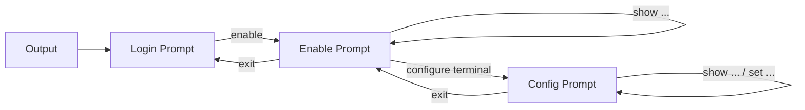
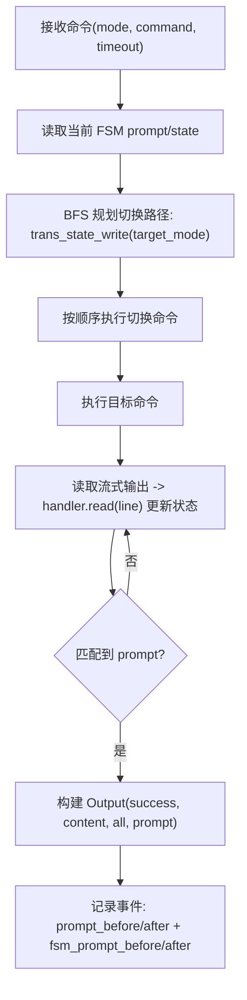

# rneter

[](https://crates.io/crates/rneter)
[](https://docs.rs/rneter)
[](https://opensource.org/licenses/MIT)

[English Documentation](README.md)

`rneter` 是一个用于管理网络设备 SSH 连接的 Rust 库，具有智能状态机处理功能。它提供了高级 API 用于连接网络设备（路由器、交换机等）、执行命令以及管理设备状态，并具备自动提示符检测和模式切换功能。

## 特性

- **连接池管理**：自动缓存和重用 SSH 连接以提高性能
- **状态机管理**：智能设备状态跟踪和自动状态转换
- **提示符检测**：自动识别和处理不同设备类型的提示符
- **模式切换**：在设备模式（用户模式、特权模式、配置模式等）之间无缝转换
- **最大兼容性**：支持广泛的 SSH 算法，包括用于旧设备的传统协议
- **异步/等待**：基于 Tokio 构建，提供高性能异步操作
- **错误处理**：全面的错误类型with详细上下文信息

## 安装

在你的 `Cargo.toml` 中添加：

```toml
[dependencies]
rneter = "0.1"
```

## 快速开始

```rust
use rneter::session::{MANAGER, Command, CmdJob};
use rneter::templates;

#[tokio::main]
async fn main() -> Result<(), Box<dyn std::error::Error>> {
    // 使用预定义的设备模板（例如：Cisco）
    let handler = templates::cisco()?;

    // 从管理器获取一个连接
    let sender = MANAGER.get(
        "admin".to_string(),
        "192.168.1.1".to_string(),
        22,
        "password".to_string(),
        None,
        handler,
    ).await?;

    // 执行命令
    let (tx, rx) = tokio::sync::oneshot::channel();
    let cmd = CmdJob {
        data: Command {
            mode: "Enable".to_string(), // Cisco 模板使用 "Enable" 模式
            command: "show version".to_string(),
            timeout: Some(60),
        },
        sys: None,
        responder: tx,
    };
    
    sender.send(cmd).await?;
    let output = rx.await??;
    
    println!("命令执行成功: {}", output.success);
    println!("输出: {}", output.content);
    Ok(())
}
```

### 安全级别

`rneter` 现在支持安全默认值，并可在连接时自定义 SSH 安全级别：

```rust
use rneter::session::{ConnectionSecurityOptions, MANAGER};
use rneter::templates;

let handler = templates::cisco()?;

// 默认安全模式（known_hosts 校验 + 严格算法）
let _sender = MANAGER.get(
    "admin".to_string(),
    "192.168.1.1".to_string(),
    22,
    "password".to_string(),
    None,
    handler,
).await?;

// 显式指定安全配置
let _sender = MANAGER.get_with_security(
    "admin".to_string(),
    "192.168.1.1".to_string(),
    22,
    "password".to_string(),
    None,
    templates::cisco()?,
    ConnectionSecurityOptions::legacy_compatible(),
).await?;
```

### 会话录制与回放

```rust
use rneter::session::{MANAGER, SessionRecordLevel, SessionReplayer};
use rneter::templates;

let (sender, recorder) = MANAGER.get_with_recording(
    "admin".to_string(),
    "192.168.1.1".to_string(),
    22,
    "password".to_string(),
    None,
    templates::cisco()?,
).await?;

// 或者仅记录关键事件（不记录原始 shell 分块）
let (_sender2, _recorder2) = MANAGER.get_with_recording_level(
    "admin".to_string(),
    "192.168.1.1".to_string(),
    22,
    "password".to_string(),
    None,
    templates::cisco()?,
    SessionRecordLevel::KeyEventsOnly,
).await?;

// ...通过 `sender` 发送 CmdJob...

// 导出为 JSONL
let jsonl = recorder.to_jsonl()?;

// 恢复并离线回放
let restored = rneter::session::SessionRecorder::from_jsonl(&jsonl)?;
let mut replayer = SessionReplayer::from_recorder(&restored);
let replayed_output = replayer.replay_next("show version")?;
println!("回放输出: {}", replayed_output.content);

// 无需真实 SSH 的离线命令流程测试
let script = vec![
    rneter::session::Command {
        mode: "Enable".to_string(),
        command: "terminal length 0".to_string(),
        timeout: None,
    },
    rneter::session::Command {
        mode: "Enable".to_string(),
        command: "show version".to_string(),
        timeout: None,
    },
];
let outputs = replayer.replay_script(&script)?;
assert_eq!(outputs.len(), 2);
```

### 事务化命令块下发

对于配置命令，可以按“块”执行并实现失败补偿回滚：

```rust
use rneter::session::{MANAGER, CommandBlockKind, RollbackPolicy, TxBlock, TxStep};
use rneter::templates;

let block = TxBlock {
    name: "addr-create".to_string(),
    kind: CommandBlockKind::Config,
    rollback_policy: RollbackPolicy::WholeResource {
        mode: "Config".to_string(),
        undo_command: "no object network WEB01".to_string(),
        timeout_secs: Some(30),
    },
    steps: vec![
        TxStep {
            mode: "Config".to_string(),
            command: "object network WEB01".to_string(),
            timeout_secs: Some(30),
            rollback_command: None,
        },
        TxStep {
            mode: "Config".to_string(),
            command: "host 10.0.0.10".to_string(),
            timeout_secs: Some(30),
            rollback_command: None,
        },
    ],
    fail_fast: true,
};

let result = MANAGER
    .execute_tx_block(
        "admin".to_string(),
        "192.168.1.1".to_string(),
        22,
        "password".to_string(),
        None,
        templates::cisco()?,
        block,
        None,
    )
    .await?;
println!(
    "committed={}, rollback_succeeded={}",
    result.committed, result.rollback_succeeded
);
```

对于“地址对象 -> 服务对象 -> 策略”这类多块统一成败场景，可使用 workflow：

```rust
use rneter::session::{TxWorkflow, TxWorkflowResult};

let workflow = TxWorkflow {
    name: "fw-policy-publish".to_string(),
    blocks: vec![addr_block, svc_block, policy_block],
    fail_fast: true,
};

let workflow_result: TxWorkflowResult = MANAGER
    .execute_tx_workflow(
        "admin".to_string(),
        "192.168.1.1".to_string(),
        22,
        "password".to_string(),
        None,
        templates::cisco()?,
        workflow,
        None,
    )
    .await?;
```

也可以直接用模板策略自动构建事务块：

```rust
let cmds = vec![
    "object network WEB01".to_string(),
    "host 10.0.0.10".to_string(),
];
let block = templates::build_tx_block(
    "cisco",
    "addr-create",
    "Config",
    &cmds,
    Some(30),
    Some("no object network WEB01".to_string()), // 整体回滚
)?;
```

对于 CI 的离线测试，可以将 JSONL 录制文件放在 `tests/fixtures/` 下，
并在集成测试中回放（参考 `tests/replay_fixtures.rs`）。

将线上录制归一化为稳定 fixture：

```bash
cargo run --example normalize_fixture -- raw_session.jsonl tests/fixtures/session_new.jsonl
```

### 模板与状态机生态

你可以把内置模板当作注册表管理，并直接对状态图做诊断：

```rust
use rneter::templates;

let names = templates::available_templates();
assert!(names.contains(&"cisco"));

let _handler = templates::by_name("juniper")?; // 大小写不敏感

let report = templates::diagnose_template("cisco")?;
println!("是否存在问题: {}", report.has_issues());
println!("死路状态: {:?}", report.dead_end_states);

let catalog = templates::template_catalog();
println!("模板数量: {}", catalog.len());

let all_json = templates::diagnose_all_templates_json()?;
println!("全部诊断 JSON 字节数: {}", all_json.len());
```

新增的录制/回放能力：

- Prompt 前后态：每条 `command_output` 都记录 `prompt_before`/`prompt_after`
- 状态机 prompt 前后态：事件可记录 `fsm_prompt_before`/`fsm_prompt_after`
- 返回值带 prompt：命令执行与离线回放的 `Output` 现在包含 `prompt`
- 事务生命周期事件：`tx_block_started`、`tx_step_succeeded`、`tx_step_failed`、`tx_rollback_started`、`tx_rollback_step_succeeded`、`tx_rollback_step_failed`、`tx_block_finished`
- 兼容旧 schema：历史 `connection_established` 的 `prompt`/`state` 字段仍可读取
- fixture 测试工作流：`tests/fixtures/` 提供成功流/失败流/状态切换样本，`tests/replay_fixtures.rs` 提供快照与质量校验

`command_output` 事件结构示例：

```json
{
  "kind": "command_output",
  "command": "show version",
  "mode": "Enable",
  "prompt_before": "router#",
  "prompt_after": "router#",
  "fsm_prompt_before": "enable",
  "fsm_prompt_after": "enable",
  "success": true,
  "content": "Version 1.0",
  "all": "show version\nVersion 1.0\nrouter#"
}
```

事务生命周期事件示例：

```json
{
  "kind": "tx_block_finished",
  "block_name": "addr-create",
  "committed": false,
  "rollback_attempted": true,
  "rollback_succeeded": true
}
```

## 架构

### 连接管理

`SshConnectionManager` 提供了通过 `MANAGER` 常量访问的单例连接池。它可以自动：
- 缓存连接 5 分钟的不活动时间
- 在连接失败时重新连接
- 管理最多 100 个并发连接

### 状态机

`DeviceHandler` 实现了一个有限状态机：
- 使用正则表达式模式跟踪当前设备状态
- 使用 BFS 算法查找状态之间的最优路径
- 处理自动状态转换
- 支持特定系统状态（例如不同的 VRF 或上下文）

#### 设计思路

这个状态机的设计基于网络设备自动化里的两个稳定事实：
1. 相比命令文本，Prompt 更适合判断当前模式。
2. 不同厂商/型号的模式切换路径不同，路径搜索必须数据驱动。

核心设计选择：
- 状态统一小写，并将 prompt 正则匹配结果映射到状态索引，保证快速定位。
- 将 prompt 检测（`read_prompt`）与状态更新（`read`）拆开，保证命令循环行为可预测。
- 将状态转换建模为有向图（`edges`），通过 BFS 找到最短可行切换路径。
- 将动态输入处理（`read_need_write`）与命令逻辑解耦，复用密码/确认类交互处理。
- 同时记录 CLI prompt 文本与 FSM prompt（状态名），便于在线诊断和离线回放断言。

这样设计的好处：
- 可移植性更好：设备差异主要通过配置表达，而不是硬编码分支。
- 稳定性更好：执行依赖 prompt/状态收敛，而不是脆弱的输出格式假设。
- 可测试性更好：可通过 record/replay 离线验证状态切换与 prompt 演化，不依赖真实 SSH。

#### 状态转换模型



#### 命令执行流程（带状态感知）



### 命令执行

命令通过基于异步通道的架构执行：
1. 向连接发送器提交一个 `CmdJob`
2. 库会在需要时自动转换到目标状态
3. 执行命令并等待提示符
4. 返回带有成功状态的输出

## 支持的设备类型

该库旨在与任何支持 SSH 的网络设备配合使用。特别适合：

- Cisco IOS/IOS-XE/IOS-XR 设备
- Juniper JunOS 设备
- Arista EOS 设备
- 华为 VRP 设备
- 通过 SSH 访问的通用 Linux/Unix 系统

## 配置

### SSH 算法支持

`rneter` 在 `config` 模块中包含全面的 SSH 算法支持：
- 密钥交换：Curve25519、DH 组、ECDH
- 加密：AES（CTR/CBC/GCM）、ChaCha20-Poly1305
- MAC：HMAC-SHA1/256/512 及 ETM 变体
- 主机密钥：Ed25519、ECDSA、RSA、DSA（用于旧设备）

这确保了与现代和传统网络设备的最大兼容性。

## 错误处理

该库通过 `ConnectError` 提供详细的错误类型：

- `UnreachableState`：无法从当前状态到达目标状态
- `TargetStateNotExistError`：请求的状态在配置中不存在
- `ChannelDisconnectError`：SSH 通道意外断开
- `ExecTimeout`：命令执行超时
- 等等...

## 文档

详细的 API 文档请访问 [docs.rs/rneter](https://docs.rs/rneter)。

## 许可证

本项目采用 MIT 许可证 - 详情请参阅 [LICENSE](LICENSE) 文件。

## 贡献

欢迎贡献！请随时提交 Pull Request。

## 作者

demohiiiii
