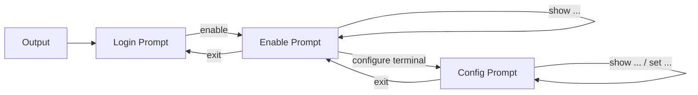
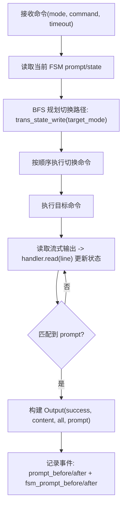

# rneter

[](https://crates.io/crates/rneter)
[](https://docs.rs/rneter)
[](https://opensource.org/licenses/MIT)

[English Documentation](README.md)

`rneter` 是一个用于管理网络设备和 Linux 主机 SSH 连接的 Rust 库，采用显式的 Prompt 状态机执行模型。它的设计思路参考了 [Netmiko](https://github.com/ktbyers/netmiko) 和 [Scrapli](https://github.com/carlmontanari/scrapli)，解决的问题域与它们类似，但更强调正式的状态切换、可复用交互流程、事务回滚以及可回放的自动化工作流。

## 目录

- [特性](#特性)
- [安装](#安装)
- [快速开始](#快速开始)
- [架构](#架构)
- [生命周期 Hook](#生命周期-hook)
- [模板自动识别](#模板自动识别)
- [与 Netmiko 和 Scrapli 的对比](#与-netmiko-和-scrapli-的对比)
- [支持的设备类型](#支持的设备类型)
- [配置](#配置)
- [错误处理](#错误处理)
- [文档](#文档)
- [许可证](#许可证)
- [贡献](#贡献)
- [作者](#作者)

## 特性

- **连接池管理**：自动缓存和重用 SSH 连接以提高性能
- **状态机管理**：智能设备状态跟踪和自动状态转换
- **提示符检测**：自动识别和处理不同设备类型的提示符
- **模式切换**：在设备模式（用户模式、特权模式、配置模式等）之间无缝转换
- **生命周期 Hook**：支持在连接后、断开前以及状态切换前后声明式执行准备/清理操作
- **模板自动识别**：在创建完整状态机会话前，先对内置模板做探测打分和候选排序
- **SFTP 文件上传**：可向开启 SSH `sftp` 子系统的远端主机上传本地文件
- **内置 Copy Flow 模板**：可复用结构化模板来驱动 Cisco-like 设备上的交互式 `copy` 流程
- **最大兼容性**：支持广泛的 SSH 算法，包括用于旧设备的传统协议
- **异步/等待**：基于 Tokio 构建，提供高性能异步操作
- **错误处理**：全面的错误类型和详细的上下文信息

## 安装

在你的 `Cargo.toml` 中添加：

```toml
[dependencies]
rneter = "0.4.4"
```

## 快速开始

```rust
use rneter::session::{ConnectionRequest, ExecutionContext, MANAGER, Command, CmdJob};
use rneter::templates;

#[tokio::main]
async fn main() -> Result<(), Box<dyn std::error::Error>> {
    // 使用预定义的设备模板（例如：Cisco）
    let handler = templates::cisco()?;

    // 从管理器获取一个连接
    let sender = MANAGER
        .get_with_context(
            ConnectionRequest::new(
                "admin".to_string(),
                "192.168.1.1".to_string(),
                22,
                "password".to_string(),
                None,
                handler,
            ),
            ExecutionContext::default(),
        )
        .await?;

    // 执行命令
    let (tx, rx) = tokio::sync::oneshot::channel();
    let cmd = CmdJob {
        data: Command {
            mode: "Enable".to_string(), // Cisco 模板使用 "Enable" 模式
            command: "show version".to_string(),
            timeout: Some(60),
            ..Command::default()
        },
        sys: None,
        responder: tx,
    };

    sender.send(cmd).await?;
    let output = rx.await??;

    println!("命令执行成功: {}", output.success);
    println!("输出: {}", output.content);
    Ok(())
}
```

### Linux 主机管理

`rneter` 支持 Linux 主机管理，并可按需配置提权方式：

```rust
use rneter::session::{ConnectionRequest, ExecutionContext, MANAGER, Command, CmdJob};
use rneter::templates;

#[tokio::main]
async fn main() -> Result<(), Box<dyn std::error::Error>> {
    let mut handler = templates::linux()?;
    handler
        .dyn_param
        .insert("SudoPassword".to_string(), "your_sudo_password".to_string());

    let sender = MANAGER
        .get_with_context(
            ConnectionRequest::new(
                "user".to_string(),
                "192.168.1.100".to_string(),
                22,
                "ssh_password".to_string(),
                None,
                handler,
            ),
            ExecutionContext::default(),
        )
        .await?;

    let (tx, rx) = tokio::sync::oneshot::channel();
    sender
        .send(CmdJob {
            data: Command {
                mode: "User".to_string(),
                command: "ls -la /home".to_string(),
                timeout: Some(30),
                ..Command::default()
            },
            sys: None,
            responder: tx,
        })
        .await?;
    let output = rx.await??;
    println!("输出: {}", output.content);

    let (tx, rx) = tokio::sync::oneshot::channel();
    sender
        .send(CmdJob {
            data: Command {
                mode: "Root".to_string(),
                command: "systemctl restart nginx".to_string(),
                timeout: Some(30),
                ..Command::default()
            },
            sys: None,
            responder: tx,
        })
        .await?;
    let output = rx.await??;
    println!("重启结果: {}", output.content);

    Ok(())
}
```

`LinuxTemplateConfig.shell_flavor` 默认使用 `DeviceShellFlavor::Posix`。如果远端登录 shell 是 `fish`，可以显式设置为 `DeviceShellFlavor::Fish`。

**自定义配置：**

```rust
use rneter::device::DeviceShellFlavor;
use rneter::templates::{linux_with_config, CustomPrompts, LinuxTemplateConfig, SudoMode};

let config = LinuxTemplateConfig {
    sudo_mode: SudoMode::SudoShell,
    sudo_password: Some("password".to_string()),
    custom_prompts: None,
    ..LinuxTemplateConfig::default()
};
let handler = linux_with_config(config)?;

let config = LinuxTemplateConfig {
    sudo_mode: SudoMode::SudoInteractive,
    sudo_password: Some("password".to_string()),
    custom_prompts: Some(CustomPrompts {
        user_prompts: vec![r"^myuser@myhost\$\s*$"],
        root_prompts: vec![r"^root@myhost#\s*$"],
    }),
    ..LinuxTemplateConfig::default()
};
let handler = linux_with_config(config)?;

let config = LinuxTemplateConfig {
    shell_flavor: DeviceShellFlavor::Fish,
    ..LinuxTemplateConfig::default()
};
let handler = linux_with_config(config)?;
```

### 安全级别

`rneter` 现在支持安全默认值，并可在连接时自定义 SSH 安全级别：

```rust
use rneter::session::{
    ConnectionRequest, ConnectionSecurityOptions, ExecutionContext, MANAGER,
};
use rneter::templates;

// 默认安全模式（known_hosts 校验 + 严格算法）
let _sender = MANAGER
    .get_with_context(
        ConnectionRequest::new(
            "admin".to_string(),
            "192.168.1.1".to_string(),
            22,
            "password".to_string(),
            None,
            templates::cisco()?,
        ),
        ExecutionContext::default(),
    )
    .await?;

// 显式指定安全配置
let _sender = MANAGER
    .get_with_context(
        ConnectionRequest::new(
            "admin".to_string(),
            "192.168.1.1".to_string(),
            22,
            "password".to_string(),
            None,
            templates::cisco()?,
        ),
        ExecutionContext::new()
            .with_security_options(ConnectionSecurityOptions::legacy_compatible()),
    )
    .await?;
```

### 文件上传

如果远端主机启用了 SSH `sftp` 子系统，`rneter` 可以在同一条认证过的 SSH 连接上上传本地文件：

```rust
use rneter::session::{ConnectionRequest, ExecutionContext, FileUploadRequest, MANAGER};
use rneter::templates;

#[tokio::main]
async fn main() -> Result<(), Box<dyn std::error::Error>> {
    let handler = templates::linux()?;

    MANAGER
        .upload_file_with_context(
            ConnectionRequest::new(
                "user".to_string(),
                "192.168.1.100".to_string(),
                22,
                "ssh_password".to_string(),
                None,
                handler,
            ),
            FileUploadRequest::new(
                "./artifacts/config.backup".to_string(),
                "/tmp/config.backup".to_string(),
            )
            .with_timeout_secs(30)
            .with_buffer_size(16 * 1024)
            .with_progress_reporting(true),
            ExecutionContext::default(),
        )
        .await?;

    Ok(())
}
```

这条路径要求远端支持 SFTP。对于只支持 `copy scp:`、`copy tftp:` 这类 CLI 传输命令的网络设备，更适合先通过 `templates` 构建 transfer flow，再交给通用的 command-flow 执行 API。

### 网络设备 SCP/TFTP 传输

对于 Cisco-like CLI，`rneter` 现在提供了一个内置的 copy flow 模板。你只需要填运行时变量，把它渲染成 `CommandFlow`，再交给通用执行入口即可：

```rust
use rneter::session::{ConnectionRequest, ExecutionContext, MANAGER};
use rneter::templates::{self, cisco_like_copy_template, CommandFlowTemplateRuntime};
use serde_json::json;

#[tokio::main]
async fn main() -> Result<(), Box<dyn std::error::Error>> {
    let flow = cisco_like_copy_template().to_command_flow(
        &CommandFlowTemplateRuntime::new()
            .with_default_mode("Enable")
            .with_vars(json!({
                "command": "copy scp: flash:/image.bin",
                "server_addr": "198.51.100.20",
                "remote_path": "/pub/image.bin",
                "transfer_username": "deploy",
                "transfer_password": "secret",
            })),
    )?;

    let result = MANAGER
        .execute_command_flow_with_context(
            ConnectionRequest::new(
                "admin".to_string(),
                "192.168.1.1".to_string(),
                22,
                "password".to_string(),
                None,
                templates::cisco()?,
            ),
            flow,
            ExecutionContext::default(),
        )
        .await?;

    if let Some(last) = result.outputs.last() {
        println!("传输输出: {}", last.content);
    }
    Ok(())
}
```

这个内置模板适配 `cisco`、`cisco_asa`、`cisco_nxos`、`arista`、`aruba_aoscx`、`chaitin`、`dell_os10`、`maipu`、`ruijie`、`venustech` 和 `zte_zxros` 这类 Cisco-like 提示风格。如果某个厂商的向导文案不同，就继续基于同一套 `CommandFlowTemplate` 自己再定义一个模板即可。
这个模板有意不在输入侧做条件分支：只需要传完整的 `command`，再配合通用的
`server_addr`、`remote_path` 和可选凭据变量即可。

### 结构化命令流模板

如果你希望交互流程不要写死在 Rust 里，可以直接构建一个可复用的
`CommandFlowTemplate`。它保留了之前 TOML 设计里的核心结构：`vars`、`steps`、
`prompts`、`default_mode`。现在这套模型是纯线性的：每一步只负责发送命令、
回答预期 prompt，然后顺序进入下一步，不再额外维护输出分支。

```rust
use rneter::templates::{
    CommandFlowTemplate, CommandFlowTemplatePrompt, CommandFlowTemplateRuntime,
    CommandFlowTemplateStep, CommandFlowTemplateVar,
};
use serde_json::json;

let template = CommandFlowTemplate::new(
    "copy_with_verify",
    vec![
        CommandFlowTemplateStep::from_template("copy {{protocol}}: {{device_path}}")
            .with_prompts(vec![
                CommandFlowTemplatePrompt::from_template(
                    vec![r"(?i)^Address or name of remote host.*\?\s*$".to_string()],
                    "{{server_addr}}",
                )
                .with_append_newline(true),
                CommandFlowTemplatePrompt::from_template(
                    vec![r"(?i)^Source (?:file ?name|filename).*\?\s*$".to_string()],
                    "{{remote_path}}",
                )
                .with_append_newline(true),
            ]),
        CommandFlowTemplateStep::from_template("verify /md5 {{device_path}}"),
    ],
)
.with_default_mode("Enable")
.with_vars(vec![
    CommandFlowTemplateVar::new("protocol")
        .with_label("Transfer Protocol")
        .with_description("Transfer protocol used by the device-side copy workflow.")
        .with_required(true)
        .with_options(["scp", "tftp"]),
    CommandFlowTemplateVar::new("server_addr")
        .with_label("Server Address")
        .with_description("SCP/TFTP server reachable from the target device.")
        .with_required(true),
    CommandFlowTemplateVar::new("remote_path")
        .with_label("Remote Path")
        .with_description("Remote file path that the device should fetch.")
        .with_required(true),
    CommandFlowTemplateVar::new("device_path")
        .with_label("Device Path")
        .with_description("Destination path on the target device.")
        .with_required(true),
]);

let flow = template.to_command_flow(
    &CommandFlowTemplateRuntime::new()
        .with_default_mode("Enable")
        .with_vars(json!({
            "protocol": "scp",
            "server_addr": "198.51.100.20",
            "remote_path": "/pub/image.bin",
            "device_path": "flash:/image.bin",
        })),
)?;
```

现在内置的 `cisco_like_copy_template()` 也是走这套结构化模板抽象，所以后面无论是
`http`、`ftp`，还是厂商自定义 copy 向导，都可以优先沉淀成同一套模板层，而不是继续往底层结构里塞特例字段。

### 自定义交互命令流程

如果设备上的流程需要多条命令，或者 prompt 文案并没有内置在模板里，可以直接构建 `CommandFlow`，并给每一步挂运行时 `PromptResponseRule`：

```rust
use rneter::session::{
    Command, CommandFlow, CommandInteraction, ConnectionRequest, ExecutionContext, MANAGER,
    PromptResponseRule,
};
use rneter::templates;

#[tokio::main]
async fn main() -> Result<(), Box<dyn std::error::Error>> {
    let flow = CommandFlow::new(vec![Command {
        mode: "Enable".to_string(),
        command: "copy http: flash:/image.bin".to_string(),
        timeout: Some(600),
        interaction: CommandInteraction::default()
            .push_prompt(PromptResponseRule::new(
                vec![r"(?i)^Address or name of remote host.*\?\s*$".to_string()],
                "203.0.113.10\n".to_string(),
            ))
            .push_prompt(PromptResponseRule::new(
                vec![r"(?i)^Source (?:file ?name|filename).*\?\s*$".to_string()],
                "/pub/image.bin\n".to_string(),
            ))
            .push_prompt(
                PromptResponseRule::new(
                    vec![r"(?i)^Destination (?:file ?name|filename).*\?\s*$".to_string()],
                    "\n".to_string(),
                )
                .with_record_input(true),
            ),
        ..Command::default()
    },
    Command {
        mode: "Enable".to_string(),
        command: "verify /md5 flash:/image.bin".to_string(),
        timeout: Some(300),
        ..Command::default()
    }]);

    let result = MANAGER
        .execute_command_flow_with_context(
            ConnectionRequest::new(
                "admin".to_string(),
                "192.168.1.1".to_string(),
                22,
                "password".to_string(),
                None,
                templates::cisco()?,
            ),
            flow,
            ExecutionContext::default(),
        )
        .await?;

    if let Some(last) = result.outputs.last() {
        println!("最后一步输出: {}", last.content);
    }
    Ok(())
}
```

运行时 prompt-response 规则会优先于模板里的静态输入规则生效，所以后续新增 `scp`、`tftp`、`http` 这类向导式 CLI 交互时，通常不需要再改底层模板定义。
整个流程会按照声明顺序线性执行，这样设备复制类向导更容易阅读、调试和复用。

### 会话录制与回放

```rust
use rneter::session::{
    ConnectionRequest, ExecutionContext, MANAGER, SessionRecordLevel, SessionReplayer,
};
use rneter::templates;

let (sender, recorder) = MANAGER
    .get_with_recording_level_and_context(
        ConnectionRequest::new(
            "admin".to_string(),
            "192.168.1.1".to_string(),
            22,
            "password".to_string(),
            None,
            templates::cisco()?,
        ),
        ExecutionContext::default(),
        SessionRecordLevel::Full,
    )
    .await?;

// 实时订阅后续录制事件
let mut rx = recorder.subscribe();
tokio::spawn(async move {
    while let Ok(entry) = rx.recv().await {
        println!("实时事件: {:?}", entry.event);
    }
});

// 或者仅记录关键事件（不记录原始 shell 分块）
let (_sender2, _recorder2) = MANAGER
    .get_with_recording_level_and_context(
        ConnectionRequest::new(
            "admin".to_string(),
            "192.168.1.1".to_string(),
            22,
            "password".to_string(),
            None,
            templates::cisco()?,
        ),
        ExecutionContext::default(),
        SessionRecordLevel::KeyEventsOnly,
    )
    .await?;

// ...通过 `sender` 发送 CmdJob...

// 导出为 JSONL
let jsonl = recorder.to_jsonl()?;

// 恢复并离线回放
let restored = rneter::session::SessionRecorder::from_jsonl(&jsonl)?;
let mut replayer = SessionReplayer::from_recorder(&restored);
let replayed_output = replayer.replay_next("show version")?;
println!("回放输出: {}", replayed_output.content);

// 无需真实 SSH 的离线命令流程测试
let script = vec![
    rneter::session::Command {
        mode: "Enable".to_string(),
        command: "terminal length 0".to_string(),
        timeout: None,
        ..rneter::session::Command::default()
    },
    rneter::session::Command {
        mode: "Enable".to_string(),
        command: "show version".to_string(),
        timeout: None,
        ..rneter::session::Command::default()
    },
];
let outputs = replayer.replay_script(&script)?;
assert_eq!(outputs.len(), 2);
```

### 事务化命令块下发

对于可变更类流程，可以按“块”执行并显式指定 `RollbackPolicy`：

```rust
use rneter::session::{
    Command, CommandFlow, ConnectionRequest, ExecutionContext, MANAGER,
    RollbackPolicy, SessionOperation, TxBlock, TxStep,
};
use rneter::templates::{self, cisco_like_copy_template, CommandFlowTemplateRuntime};

let block = TxBlock {
    name: "addr-create".to_string(),
    rollback_policy: RollbackPolicy::WholeResource {
        rollback: Box::new(
            Command {
                mode: "Config".to_string(),
                command: "no object network WEB01".to_string(),
                timeout: Some(30),
                ..Command::default()
            }
            .into(),
        ),
        trigger_step_index: 0,
    },
    steps: vec![
        TxStep::new(Command {
            mode: "Config".to_string(),
            command: "object network WEB01".to_string(),
            timeout: Some(30),
            ..Command::default()
        }),
        TxStep::new(CommandFlow::new(vec![
            Command {
                mode: "Config".to_string(),
                command: "host 10.0.0.10".to_string(),
                timeout: Some(30),
                ..Command::default()
            },
            Command {
                mode: "Config".to_string(),
                command: "description WEB01".to_string(),
                timeout: Some(30),
                ..Command::default()
            },
        ])),
    ],
    fail_fast: true,
};

let result = MANAGER
    .execute_tx_block_with_context(
        ConnectionRequest::new(
            "admin".to_string(),
            "192.168.1.1".to_string(),
            22,
            "password".to_string(),
            None,
            templates::cisco()?,
        ),
        block,
        ExecutionContext::default(),
    )
    .await?;
println!(
    "committed={}, rollback_succeeded={}",
    result.committed, result.rollback_succeeded
);
```

现在 `TxStep::new(...)` 接受的是任意 `SessionOperation`，所以 workflow 里的一个步骤既可以是
单条命令，也可以是多步 `CommandFlow`，或者一个可复用的模板调用：

```rust
let copy_step = TxStep::new(SessionOperation::template(
    cisco_like_copy_template(),
    CommandFlowTemplateRuntime::new().with_vars(serde_json::json!({
        "command": "copy scp: flash:/fw.bin",
        "server_addr": "192.168.1.100",
        "remote_path": "/srv/images/fw.bin",
        "transfer_username": "deploy",
        "transfer_password": "secret",
    })),
));

let summary = copy_step.run.summary()?;
println!(
    "kind={} mode={} steps={} desc={}",
    summary.kind, summary.mode, summary.step_count, summary.description
);
```

对于“地址对象 -> 服务对象 -> 策略”这类多块统一成败场景，可使用 workflow：

```rust
use rneter::session::{TxWorkflow, TxWorkflowResult};

let workflow = TxWorkflow {
    name: "fw-policy-publish".to_string(),
    blocks: vec![addr_block, svc_block, policy_block],
    fail_fast: true,
};

let workflow_result: TxWorkflowResult = MANAGER
    .execute_tx_workflow_with_context(
        ConnectionRequest::new(
            "admin".to_string(),
            "192.168.1.1".to_string(),
            22,
            "password".to_string(),
            None,
            templates::cisco()?,
        ),
        workflow,
        ExecutionContext::default(),
    )
    .await?;

for block in &workflow_result.block_results {
    for step in &block.step_results {
        println!(
            "step[{}] op={} execution={:?} rollback={:?}",
            step.step_index,
            step.operation_summary,
            step.execution_state,
            step.rollback_state
        );
        for child in &step.forward_operation_steps {
            println!(
                "  forward_step[{}] op={} success={}",
                child.step_index, child.operation_summary, child.success
            );
        }
        for child in &step.rollback_operation_steps {
            println!(
                "  rollback_step[{}] op={} success={}",
                child.step_index, child.operation_summary, child.success
            );
        }
    }
    if let Some(block_rollback) = &block.block_rollback_operation_summary {
        println!("block_rollback={block_rollback}");
        for child in &block.block_rollback_steps {
            println!(
                "  block_rollback_step[{}] op={} success={}",
                child.step_index, child.operation_summary, child.success
            );
        }
    }
}
```

也可以直接用模板策略自动构建事务块：

```rust
let cmds = vec![
    "object network WEB01".to_string(),
    "host 10.0.0.10".to_string(),
];
let block = templates::build_tx_block(
    "cisco",
    "addr-create",
    "Config",
    &cmds,
    Some(30),
    Some("no object network WEB01".to_string()), // 整体回滚
)?;
```

对于 CI 的离线测试，可以将 JSONL 录制文件放在 `tests/fixtures/` 下，
并在集成测试中回放（参考 `tests/replay_fixtures.rs`）。

将线上录制归一化为稳定 fixture：

```bash
cargo run --example normalize_fixture -- raw_session.jsonl tests/fixtures/session_new.jsonl
```

### 模板与状态机生态

你可以把内置模板当作注册表管理，并直接对状态图做诊断：

```rust
use rneter::templates;

let names = templates::available_templates();
assert!(names.contains(&"cisco"));

let _handler = templates::by_name("juniper")?; // 大小写不敏感

let report = templates::diagnose_template("cisco")?;
println!("是否存在问题: {}", report.has_issues());
println!("死路状态: {:?}", report.dead_end_states);

let catalog = templates::template_catalog();
println!("模板数量: {}", catalog.len());

let all_json = templates::diagnose_all_templates_json()?;
println!("全部诊断 JSON 字节数: {}", all_json.len());
```

也可以先导出内置模板配置，再按需扩展后重新构建：

```rust
use rneter::device::prompt_rule;
use rneter::templates;

let mut config = templates::by_name_config("cisco")?;
config
    .prompt
    .push(prompt_rule("CustomMode", &[r"^custom>\s*$"]));

let handler = config.build()?;
assert!(handler.states().iter().any(|state| state == "custommode"));
```

新增的录制/回放能力：

- Prompt 前后态：每条 `command_output` 都记录 `prompt_before`/`prompt_after`
- 状态机 prompt 前后态：事件可记录 `fsm_prompt_before`/`fsm_prompt_after`
- 返回值带 prompt：命令执行与离线回放的 `Output` 现在包含 `prompt`
- 事务生命周期事件：`tx_block_started`、`tx_step_succeeded`、`tx_step_failed`、`tx_rollback_started`、`tx_rollback_step_succeeded`、`tx_rollback_step_failed`、`tx_block_finished`
- 兼容旧 schema：历史 `connection_established` 的 `prompt`/`state` 字段仍可读取
- fixture 测试工作流：`tests/fixtures/` 提供成功流/失败流/状态切换样本，`tests/replay_fixtures.rs` 提供快照与质量校验

`command_output` 事件结构示例：

```json
{
  "kind": "command_output",
  "command": "show version",
  "mode": "Enable",
  "prompt_before": "router#",
  "prompt_after": "router#",
  "fsm_prompt_before": "enable",
  "fsm_prompt_after": "enable",
  "success": true,
  "content": "Version 1.0",
  "all": "show version\nVersion 1.0\nrouter#"
}
```

事务生命周期事件示例：

```json
{
  "kind": "tx_block_finished",
  "block_name": "addr-create",
  "committed": false,
  "rollback_attempted": true,
  "rollback_succeeded": true
}
```

## 架构

### 连接管理

`SshConnectionManager` 提供了通过 `MANAGER` 常量访问的单例连接池。它可以自动：

- 缓存连接 5 分钟的不活动时间
- 在连接失败时重新连接
- 管理最多 100 个并发连接

### 状态机

`DeviceHandler` 实现了一个有限状态机：

- 使用正则表达式模式跟踪当前设备状态
- 使用 BFS 算法查找状态之间的最优路径
- 处理自动状态转换
- 支持特定系统状态（例如不同的 VRF 或上下文）

#### 设计思路

这个状态机的设计基于网络设备自动化里的两个稳定事实：

1. 相比命令文本，Prompt 更适合判断当前模式。
2. 不同厂商/型号的模式切换路径不同，路径搜索必须数据驱动。

核心设计选择：

- 状态统一小写，并将 prompt 正则匹配结果映射到状态索引，保证快速定位。
- 将 prompt 检测（`read_prompt`）与状态更新（`read`）拆开，保证命令循环行为可预测。
- 将状态转换建模为有向图（`edges`），通过 BFS 找到最短可行切换路径。
- 将动态输入处理（`read_need_write`）与命令逻辑解耦，复用密码/确认类交互处理。
- 同时记录 CLI prompt 文本与 FSM prompt（状态名），便于在线诊断和离线回放断言。

这样设计的好处：

- 可移植性更好：设备差异主要通过配置表达，而不是硬编码分支。
- 稳定性更好：执行依赖 prompt/状态收敛，而不是脆弱的输出格式假设。
- 可测试性更好：可通过 record/replay 离线验证状态切换与 prompt 演化，不依赖真实 SSH。

#### 状态转换模型


```mermaid
flowchart LR
    O["Output"] --> L["Login Prompt"]
    L -->|enable| E["Enable Prompt"]
    E -->|configure terminal| C["Config Prompt"]
    C -->|exit| E
    E -->|exit| L
    E -->|show ...| E
    C -->|show ... / set ...| C
```

#### 命令执行流程（带状态感知）


```mermaid
flowchart TD
    A["接收命令(mode, command, timeout)"] --> B["读取当前 FSM prompt/state"]
    B --> C["BFS 规划切换路径: trans_state_write(target_mode)"]
    C --> D["按顺序执行切换命令"]
    D --> E["执行目标命令"]
    E --> F["读取流式输出 -> handler.read(line) 更新状态"]
    F --> G{"匹配到 prompt?"}
    G -->|否| F
    G -->|是| H["构建 Output(success, content, all, prompt)"]
    H --> I["记录事件: prompt_before/after + fsm_prompt_before/after"]
```

### 命令执行

命令通过基于异步通道的架构执行：

1. 向连接发送器提交一个 `CmdJob`
2. 库会在需要时自动转换到目标状态
3. 执行命令并等待提示符
4. 返回带有成功状态的输出

调用方传入的 mode 名称会在内部统一转成小写匹配，因此 `"Enable"`、`"enable"`、`"ENABLE"` 都会指向同一个 FSM 状态。

## 生命周期 Hook

`rneter` 现在可以通过 `DeviceHandlerConfig.hooks` 声明生命周期 Hook：

- `after_connect`
- `before_disconnect`
- `after_enter_state`
- `before_exit_state`

Hook 复用了 `SessionOperation`，因此既可以执行单条命令，也可以执行命令流。在 `0.4.4` 中，连接级 Hook 先限定为模板级能力，这样就不会和连接缓存复用产生行为歧义；状态级 Hook 则会自动按内部小写 FSM 状态名做归一化匹配。

内置模板也可以提供默认行为，例如：

- Cisco/ASA 会在连接后执行 `terminal pager 0`
- Juniper 会在连接后执行 `set cli screen-length 0`

Hook 的输出不会并入父命令返回结果，但 Hook 的生命周期事件会进入 session recorder。

## 模板自动识别

`rneter` 现在可以在真正创建 `DeviceHandler` 之前，先对内置模板做自动识别和排序。

自动识别返回的是一份候选报告，而不是一个不可解释的单值结果，核心字段包括：

- `best_match`
- `candidates`
- `raw_facts`

这样在现场环境里更容易理解“为什么它更像 Cisco / Juniper / Huawei / H3C / Linux / Arista / Aruba AOS-CX / Cisco ASA/NX-OS / Dell OS10 / Ruijie / ZTE ZXROS / Fortinet / Palo Alto / Check Point”，也更方便排查误判。

当前范围：

- 仅支持 SSH
- 当前已覆盖的内置模板：`cisco`、`juniper`、`huawei`、`h3c`、`linux`、`hillstone`、`arista`、`aruba_aoscx`、`cisco_asa`、`cisco_nxos`、`dell_os10`、`fortinet`、`paloalto`、`ruijie`、`zte_zxros`、`checkpoint`
- `cisco_asa` 作为独立模板名和自动识别目标暴露，但当前复用已经验证过的 `cisco` handler 行为
- 基于初始 prompt/输出和只读 probe 命令做缓存式打分

如何理解诊断结果：

- `raw_facts` 现在同时包含“正向命中”和“probe 错误命中”两类事实。
- 正向事实表示某条 prompt 或 probe 输出命中了加分正则，因此会贡献分数。
- 错误事实表示这条 probe 输出命中了 `Invalid input`、`Unrecognized command`、`command not found` 之类的错误模式；此时该 probe 会像 Netmiko 的 autodetect 一样，被视为无效而不参与加分。
- 这样更容易区分“这台设备不像 Cisco”和“Cisco 的探测命令在这里根本不成立”这两种情况。

示例：

```rust
use rneter::session::{DetectRequest, ExecutionContext};
use rneter::templates::autodetect_with_context;

# async fn demo() -> Result<(), Box<dyn std::error::Error>> {
let report = autodetect_with_context(
    DetectRequest::new(
        "admin".to_string(),
        "192.168.1.1".to_string(),
        22,
        "password".to_string(),
    ),
    ExecutionContext::default(),
)
.await?;

if let Some(best) = &report.best_match {
    println!("最佳模板: {} ({:?}, score={})", best.template_name, best.confidence, best.score);
}

for candidate in &report.candidates {
    println!("候选模板: {} score={}", candidate.template_name, candidate.score);
}
# Ok(())
# }
```

如果最佳候选满足最小置信度阈值，也可以直接继续建立正式连接：

```rust
use rneter::session::{ExecutionContext, DetectRequest};
use rneter::templates::{
    autodetect_and_connect_with_context, DetectConnectPolicy,
};

# async fn demo() -> Result<(), Box<dyn std::error::Error>> {
let connected = autodetect_and_connect_with_context(
    DetectRequest::new(
        "admin".to_string(),
        "192.168.1.1".to_string(),
        22,
        "password".to_string(),
    ),
    None,
    ExecutionContext::default(),
    DetectConnectPolicy::default(), // 默认最小置信度 = Medium
)
.await?;

println!("连接使用模板: {}", connected.template_name);
# Ok(())
# }
```

## 与 Netmiko 和 Scrapli 的对比

如果你之前主要使用 [Netmiko](https://github.com/ktbyers/netmiko) 或
[Scrapli](https://github.com/carlmontanari/scrapli)，最需要先建立的认知是：
`rneter` 的抽象边界和它们不完全一样。

- `Netmiko` 更像一个围绕 prompt 驱动命令执行的设备会话工具库。
- `Scrapli` 更像一个围绕 transport/channel/driver 和 privilege level 的设备连接工具库。
- `rneter` 更像一个围绕显式状态、状态边和可复用操作构建的 Prompt 状态机执行引擎。

从底层机制上说：

- 在 `Netmiko` 里，prompt 主要用于判断一条命令什么时候执行结束。
- 在 `Scrapli` 里，prompt 和 privilege level 主要用于维持 channel 与预期模式对齐。
- 在 `rneter` 里，prompt 不仅用于判断命令结束，还会驱动正式状态机更新当前状态。

### 机制对照

| 维度                  | `rneter`                                                                 | `Netmiko`                                                                | `Scrapli`                                                  | 说明                                                  |
| --------------------- | ------------------------------------------------------------------------ | ------------------------------------------------------------------------ | ---------------------------------------------------------- | ----------------------------------------------------- |
| 核心抽象              | `DeviceHandler` 是正式有限状态机，包含 prompt 规则、输入规则和状态迁移边 | `BaseConnection` 是 prompt 驱动的设备会话对象                            | `Driver + Channel + Transport`，并配合平台 privilege level | `rneter` 对设备行为建模更显式，另外两者先强调会话交互 |
| Prompt 的角色         | Prompt 既是状态事件，也是命令结束信号                                    | Prompt 主要是命令结束信号                                                | Prompt 主要用于 channel 对齐和结束判定                     | `rneter` 把 prompt 当作控制面数据，而不仅是输出分隔符 |
| 模式切换              | 基于显式 `edges` 做 BFS 自动寻路                                         | 常见是 `enable()`、`config_mode()`、`exit_config_mode()` 这类专用 helper | 常见是切换到目标 privilege level                           | `rneter` 更容易泛化复杂模式图                         |
| 交互输入              | 输入提示也是状态机规则的一部分，还能按 command flow 扩展                 | 常通过 `send_command_timing()`、`send_multiline()` 等方式处理            | 常通过交互式 channel 操作和显式 prompt 期望处理            | `rneter` 更适合复用设备向导式交互                     |
| 多行 / 脏 Prompt 处理 | 统一做流式清洗、prompt prefix 缓冲、片段合并再匹配                       | 常见是 ANSI/backspace 清洗后直接读 prompt                                | 常见是 channel prompt pattern 搜索和显式读取               | `rneter` 在复杂 prompt 场景下投入了更多底层机制       |
| 错误处理              | 错误行可映射为状态机 `error` 状态，也可通过 `ignore_errors` 忽略         | 主要是方法级或输出模式级判断                                             | 主要是 response 失败条件或上层逻辑判断                     | `rneter` 更容易把错误语义收敛到统一执行流程中         |
| 输出模型              | `Output.success`、`content`、`all`、`prompt`、可选 `exit_code`、录制事件 | 以处理后的字符串输出为主，外加辅助解析手段                               | 以 response 对象为主，包含原始/处理后输出和 channel 元信息 | `rneter` 更偏编排和回放，而不仅是交互式使用           |
| Linux 支持            | Linux 复用同一套状态执行引擎，并支持 shell exit-status 捕获              | 不是主要设计中心                                                         | 支持，但仍偏 channel/prompt 视角                           | `rneter` 更容易统一网络设备和 Linux 主机的执行语义    |
| 事务 / 回滚           | 内置 `TxBlock`、`TxWorkflow`、回滚策略和子步骤结果                       | 需要调用方自行组织                                                       | 需要调用方自行组织                                         | 这是 `rneter` 与另外两者最明显的架构差异之一          |
| 回放 / 固件测试       | 内置 session recording / replay                                          | 不是核心架构能力                                                         | 不是核心架构能力                                           | `rneter` 更适合作为 CLI 自动化平台底层内核            |

### 同一任务下的不同心智模型

| 任务                         | `Netmiko` 的常见思路                                | `Scrapli` 的常见思路                            | `rneter` 的常见思路                                            |
| ---------------------------- | --------------------------------------------------- | ----------------------------------------------- | -------------------------------------------------------------- |
| 执行 `show version`          | 发命令并一直读到 prompt                             | 通过 channel 发命令并一直读到 prompt pattern    | 先收敛到目标 mode，再执行命令，并用返回 prompt 更新 FSM        |
| 下发配置命令                 | 进入 config mode，发命令，必要时退出                | 切换到 config privilege，发送配置，再视情况切回 | 把 config 视为一个状态节点，并通过状态边自动路由过去           |
| 处理 `copy scp:` 交互        | 用 timing / multiline helper 加预期 prompt 逐步处理 | 用交互式 send/read 操作配合显式 prompt 期望处理 | 建模成可复用 `CommandFlow` 或 `CommandFlowTemplate`            |
| 处理 `[edit]` + `user@host#` | 调整平台 prompt 逻辑                                | 调整 prompt pattern / channel 行为              | 将 `[edit]` 建模为 prompt prefix，并在匹配前与后续 prompt 合并 |

### 为什么这很重要

对 `Netmiko` 用户来说，`rneter` 更不像“另一个更强的 `send_command`”，而更像
“一个知道设备当前状态、并能围绕状态执行自动化编排的执行引擎”。

对 `Scrapli` 用户来说，`rneter` 更不像“另一个 driver/channel 栈”，而更像
“在 prompt 解析之上再往上一层，正式构建状态图和执行模型的系统”。

这也是为什么 `rneter` 在下面这些场景里会特别有优势：

- 多步骤命令工作流
- 厂商特定的交互式向导
- 事务化下发与回滚
- 基于 prompt 的可回放测试
- 同时覆盖网络设备和 Linux 主机的统一编排层

对应的代价是：相比 `Netmiko` 和 `Scrapli`，`rneter` 会更频繁地要求调用方从
“状态、迁移和执行模型”的角度思考问题。

## 支持的设备类型

该库旨在与任何支持 SSH 的网络设备和 Linux 主机配合使用。特别适合：

**网络设备：**

| 模板名        | 厂商 / 平台               | 主要模式                                | 备注                                                |
| ------------- | ------------------------- | --------------------------------------- | --------------------------------------------------- |
| `cisco`       | Cisco IOS / IOS-XE        | `Login`、`Enable`、`Config`             | 也作为 `cisco_asa` 当前已验证的 handler 行为        |
| `cisco_asa`   | Cisco ASA                 | `Login`、`Enable`、`Config`             | 独立模板名和自动识别目标；复用 `cisco` handler 行为 |
| `cisco_nxos`  | Cisco NX-OS               | `Login`、`Enable`、`Config`             | Cisco-like 模式切换，包含 NX-OS 分页默认设置        |
| `juniper`     | Juniper JunOS             | `Enable`、`Config`                      | 支持 JunOS edit prompt prefix 处理                  |
| `arista`      | Arista EOS                | `Login`、`Enable`、`Config`             | 面向 EOS 的 Cisco-like 模板                         |
| `aruba_aoscx` | Aruba AOS-CX              | `Login`、`Enable`、`Config`             | 使用 AOS-CX 分页默认设置                            |
| `dell_os10`   | Dell OS10                 | `Login`、`Enable`、`Config`             | 面向 Dell OS10 的 Cisco-like 模板                   |
| `ruijie`      | 锐捷 Ruijie RGOS          | `Login`、`Enable`、`Config`             | 包含拒绝修改密码提示的交互规则                      |
| `zte_zxros`   | 中兴 ZTE ZXROS            | `Login`、`Enable`、`Config`             | 面向 ZTE ZXROS 的 Cisco-like 模板                   |
| `huawei`      | 华为 Huawei VRP           | `Enable`、`Config`                      | 使用 `system-view` / `return` 模式切换              |
| `h3c`         | H3C Comware               | `Enable`、`Config`                      | Comware 风格尖括号/方括号 prompt                    |
| `hillstone`   | Hillstone SG / StoneOS    | `Enable`、`Config`                      | 包含保存确认提示                                    |
| `array`       | Array Networks APV        | `Login`、`Enable`、`Config`、vsite 模式 | 支持系统/上下文模式变体                             |
| `fortinet`    | Fortinet FortiGate        | `Enable`、vdom 模式                     | 基础 FortiGate / VDOM 状态模型                      |
| `paloalto`    | Palo Alto Networks PAN-OS | `Enable`、`Config`                      | Operational 和 config prompt                        |
| `checkpoint`  | Check Point Gaia          | `Enable`                                | 只读/操作类模板                                     |
| `topsec`      | Topsec NGFW               | `Enable`                                | 基础操作类模板                                      |
| `venustech`   | 启明星辰 Venustech USG    | `Login`、`Enable`、`Config`             | Cisco-like 防火墙模板                               |
| `dptech`      | 迪普 DPTech 防火墙        | `Enable`、`Config`                      | H3C-like prompt 风格                                |
| `chaitin`     | 长亭 Chaitin SafeLine     | `Login`、`Enable`、`Config`             | Cisco-like 网关模板                                 |
| `qianxin`     | 奇安信 QiAnXin NSG        | `Enable`、`Config`                      | 安全网关模板                                        |
| `maipu`       | 迈普通信 Maipu 网络设备   | `Login`、`Enable`、`Config`             | 面向 Maipu 设备的 Cisco-like 模板                   |

**Linux 主机：**

| 模板名  | 范围              | 备注                                                          |
| ------- | ----------------- | ------------------------------------------------------------- |
| `linux` | 通用 Linux 发行版 | Ubuntu、Debian、CentOS、RHEL 以及其他基于 shell 的 Linux 主机 |
| `linux` | 提权方式          | 支持 `sudo -i`、`sudo -s`、`su` 和直接 root 会话              |
| `linux` | Prompt 处理       | 支持带自定义 pattern 的智能 prompt 检测                       |
| `linux` | 事务能力          | 支持带回滚策略的事务式配置管理                                |

## 配置

### SSH 算法支持

`rneter` 在 `config` 模块中包含全面的 SSH 算法支持：

- 密钥交换：Curve25519、DH 组、ECDH
- 加密：AES（CTR/CBC/GCM）、ChaCha20-Poly1305
- MAC：HMAC-SHA1/256/512 及 ETM 变体
- 主机密钥：Ed25519、ECDSA、RSA、DSA（用于旧设备）

这确保了与现代和传统网络设备的最大兼容性。

## 错误处理

该库通过 `ConnectError` 提供详细的错误类型：

- `UnreachableState`：无法从当前状态到达目标状态
- `TargetStateNotExistError`：请求的状态在配置中不存在
- `ChannelDisconnectError`：SSH 通道意外断开
- `ExecTimeout`：命令执行超时
- 等等...

对于 `execute_operation_with_context(...)` 这类 operation 级 API，失败时现在会返回
`SessionOperationExecutionError`，可通过 `partial_output()` 读取失败前已完成的子步骤结果。

## 文档

详细的 API 文档请访问 [docs.rs/rneter](https://docs.rs/rneter)。

## 许可证

本项目采用 MIT 许可证 - 详情请参阅 [LICENSE](LICENSE) 文件。

## 贡献

欢迎贡献！请随时提交 Pull Request。

## 作者

demohiiiii
